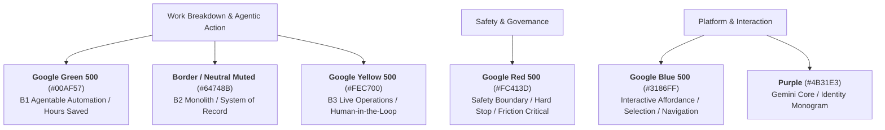

# Gemini Enterprise & Google Cloud "Aurora" Brand Guidelines

> **Single Source of Truth for Slide Decks, Web Demonstrations, and Agent Artifacts**  
> **Repository:** `O&G_slidedeck_agentic_transformation`  
> **Status:** Active & Normative

---

## 1. Official Sources & Citations

| Scope | Resource | Location / URI | Notes |
|---|---|---|---|
| **Internal (Primary)** | **Gemini Playbook 2.0** | `go/geminiplaybook2.0` / [Google Slides Deck](https://docs.google.com/presentation/d/1eTWCkU6ds75E7Gp8p0oO7trQXCeMoLFbNJSUEGcnH0A) | Master internal presentation on Gemini Enterprise brand assets, messaging, and visual design rules. |
| **Internal (System)** | **Google Cloud Brand Identity · Color** | `https://sites.google.com/google.com/overview/brand-identity/color` (`go/overview/brand-identity`) | Official specification of Aurora color tokens, roles, and contrast requirements. |
| **Internal (System)** | **Google Cloud Brand Identity · Gradients** | `https://sites.google.com/google.com/overview/brand-identity/gradients` | Permitted gradient pairs, angle guidance, and negative constraints. |
| **External (Legal)** | **Customer Co-branding Guidelines** | `https://cloud.google.com/terms/co-branding-guidelines` | Public trademark and attribution guidelines for partners and enterprise customers. |
| **External (General)** | **Google Brand Resource Center** | `https://about.google/brand-resource-center/` | General brand standards, logo clear-space rules, and trademark protections. |
| **In-Repo Proof** | **Palette Live Proof Sheet** | [`personas/_palette.html`](./personas/_palette.html) | Self-grading testbed reading live CSS computed styles against official Aurora hexes. |
| **In-Repo Audit** | **Design & Formatting Audit** | [`style_audit.md`](./style_audit.md) | Comprehensive audit cataloging legacy drifts, token mismatches, and remediation steps. |

---

## 2. Core Palette: The "Aurora" Tokens

Google Cloud's current design system is **Aurora**. It fundamentally replaces legacy Material GM2 colors (e.g. `#1A73E8`, `#4285F4`, `#34A853`, `#EA4335`).

### Primary Core Tokens

| Token | Brand Name | Hex | RGB | Semantic Role | Deprecated / Legacy Value |
|---|---|---|---|---|---|
| `--g-blue` | **Google Blue 500** | `#3186FF` | `rgb(49, 134, 255)` | Interactive states, selection, primary buttons, agent refs | `#1A73E8`, `#4285F4` |
| `--g-purple` | **Purple** | `#4B31E3` | `rgb(75, 49, 227)` | Gemini intelligence, monogram identity fallback | `#7B1FA2`, `#9333EA` |
| `--g-green` | **Google Green 500** | `#00AF57` | `rgb(0, 175, 87)` | B1 Agentable work, hours saved, positive verification | `#34A853`, `#1E8E3E` |
| `--g-yellow` | **Google Yellow 500** | `#FEC700` | `rgb(254, 199, 0)` | B3 Live operations (human-in-the-loop), active attention | `#FBBC04`, `#F59E0B` |
| `--g-red` | **Google Red 500** | `#FC413D` | `rgb(252, 65, 61)` | Safety envelope, hard stop, critical friction, errors | `#EA4335`, `#D93025` |

### Neutral Canvas & Surface Tokens

| Token | Brand Name | Hex | Usage Context | Rule |
|---|---|---|---|---|
| `--g-grey-10` | **Google Grey 10** | `#F8F9FC` | Light mode canvas background, sunken card wells | Default page background |
| `--surface-light` | **White** | `#FFFFFF` | Light mode card surface, modal surface | Default elevated element |
| `--g-grey-1200`| **Google Grey 1200**| `#121317` | Dark mode canvas background | **NEVER use pure black (`#000000`)** |
| `--surface-dark` | **Dark Surface** | `#1A1C22` | Dark mode elevated card surface | 1-step elevation over Grey 1200 |
| `--border-dark` | **Dark Border** | `#262833` | Subtle structural dividers in dark mode | Hairline 1px border |
| `--border-light`| **Light Border** | `#E2E6F0` | Subtle structural dividers in light mode | Hairline 1px border |

---

## 3. Semantic Meaning Matrix

In Gemini Enterprise and the Oil & Gas slide transformation deck, color is strictly **load-bearing**, never arbitrary decoration:



---

## 4. Gradients & The "Gemini Spark"

### Approved Two-Color Gradient Pairs
Aurora authorizes exactly **five adjacent-spectrum gradient pairs**. All linear gradients must follow these combinations:

1. **Blue → Purple** (`#3186FF` → `#4B31E3`): The official **Gemini AI / Spark** gradient.
2. **Green → Blue** (`#00AF57` → `#3186FF`): Autonomous transformation & efficiency.
3. **Yellow → Green** (`#FEC700` → `#00AF57`): Operations to automated handoff.
4. **Red → Yellow** (`#FC413D` → `#FEC700`): Warning, high friction, risk escalation.
5. **Red → Purple** (`#FC413D` → `#4B31E3`): Critical boundary & security governance.

### Strict Negative Rules (Verbatim from Brand Guidelines)
* ❌ **Do NOT use gradients as page or section backgrounds**: Slide backgrounds and container cards must be solid flat surfaces (`#F8F9FC` or `#121317`).
* ❌ **Do NOT use gradients to highlight text**: Never apply `-webkit-background-clip: text; color: transparent` to headings or paragraph copy. Text must be solid, high-contrast typography.
* ❌ **Do NOT create custom non-adjacent gradients**: e.g., Green to Red or Purple to Yellow are strictly prohibited.
* ❌ **Do NOT use tints or shades of gradient colors**: Use only the exact 500-level values.

---

## 5. Typography

Google's proprietary type family establishes product clarity and hierarchy:

```css
/* Display & Headlines */
font-family: 'Google Sans', -apple-system, BlinkMacSystemFont, 'Segoe UI', Roboto, sans-serif;

/* Body Copy & Data Labels */
font-family: 'Google Sans Text', -apple-system, BlinkMacSystemFont, 'Segoe UI', Roboto, sans-serif;

/* Metrics, Timestamps, Agent Codes, Numbers */
font-family: 'Roboto Mono', 'Google Sans Mono', monospace;
```

### Type Scale Hierarchy

| Level | Size / Line-height | Weight | Usage |
|---|---|---|---|
| **Display / Title** | `32px / 1.15` | `600` (Medium / Semi-bold) | Deck title, persona name |
| **Section Header** | `20px / 1.25` | `600` | Card header, section titles |
| **Subhead** | `15px / 1.35` | `500` | Persona role, operational context |
| **Body Default** | `13.5px / 1.5` | `400` (Regular) | Narrative paragraph, pain points, agent descriptions |
| **Caption / Meta** | `11.5px / 1.4` | `400` / `500` | Badges, tags, attribution, timestamps |
| **Mono Metrics** | `12px – 28px` | `500` / `600` | `28px` for hero hours saved; `12px` for agent IDs (`P04-01`) |

---

## 6. Accessibility & Contrast (WCAG 2.1)

Aurora Blue 500 (`#3186FF`) on White (`#FFFFFF`) produces a contrast ratio of **3.51:1**.
* **Display / UI Elements**: Approved for badges, active tab borders, icons, and hero metrics (≥24px).
* **Body Text**: ⚠️ **Fails WCAG AA (4.5:1 requirement)**.
* **Rule**: For continuous reading copy on white/light surfaces, use high-contrast text (`#121317` or `#1F2937`), reserving `#3186FF` for links, badges with backgrounds, and interactive controls.

| Pair | Surface | Computed Ratio | Rating | Permitted Use |
|---|---|---|---|---|
| `#121317` (Text) | `#FFFFFF` (Surface) | **16.1 : 1** | **Pass AAA** | Standard body copy |
| `#475569` (Muted) | `#FFFFFF` (Surface) | **6.4 : 1** | **Pass AA** | Secondary copy, descriptors |
| `#3186FF` (Blue 500) | `#FFFFFF` (Surface) | **3.51 : 1** | **Large text only** | Icons, large titles (≥24px), buttons |
| `#00AF57` (Green 500)| `#FFFFFF` (Surface) | **3.22 : 1** | **Large text only** | Large hours saved figures (28px) |
| `#FFFFFF` (White) | `#121317` (Dark Canvas)| **16.1 : 1** | **Pass AAA** | Dark mode body text |
| `#3186FF` (Blue 500) | `#121317` (Dark Canvas)| **4.62 : 1** | **Pass AA** | Interactive elements on dark mode |

---

## 7. Product Naming, Framing & Attribution

To maintain brand consistency across all customer-facing collateral:

### Permitted Phrases
* **"Gemini Enterprise"** (Product name)
* **"Built with AI from Google Cloud"** (Customer co-branding tagline)
* **"Powered by Gemini 1.5 Pro / Flash"** (Technical architecture reference)
* **"Google Cloud Agentic Architecture"** (System framing)

### Forbidden Phrases
* ❌ *"Google Gemini Enterprise"* (Do not prefix Google before Gemini Enterprise)
* ❌ *"Powered by Google"* (Violates Google Cloud co-branding policy)
* ❌ *"Google AI Engine"* or *"Gemini Bot"* (Generic / non-standard terminology)

---

## 8. Reference CSS Implementation (`assets/aurora.css`)

Copy and paste this snippet into projects or shared styles:

```css
:root {
  /* Official Google Cloud Aurora Core */
  --g-blue: #3186FF;
  --g-purple: #4B31E3;
  --g-green: #00AF57;
  --g-yellow: #FEC700;
  --g-red: #FC413D;
  --g-grey-10: #F8F9FC;
  --g-grey-1200: #121317;

  /* Typography */
  --font-display: 'Google Sans', -apple-system, BlinkMacSystemFont, sans-serif;
  --font-body: 'Google Sans Text', -apple-system, BlinkMacSystemFont, sans-serif;
  --font-mono: 'Roboto Mono', 'Google Sans Mono', monospace;

  /* Approved Gemini Spark Gradient */
  --gemini-spark: linear-gradient(135deg, var(--g-blue) 0%, var(--g-purple) 100%);
  --transform-grad: linear-gradient(135deg, var(--g-green) 0%, var(--g-blue) 100%);

  /* Default Canvas & Surfaces (Light Mode) */
  --canvas: var(--g-grey-10);
  --surface: #FFFFFF;
  --surface-sunk: #F1F3F9;
  --border-subtle: #E2E6F0;
  --border-strong: #CBD5E1;
  --text: #121317;
  --text-muted: #5F6368;
  --text-dim: #80868B;
  --accent: var(--g-blue);
}

/* Dark Theme Surface Hierarchy */
body.theme-dark, html.theme-dark {
  --canvas: var(--g-grey-1200);
  --surface: #1A1C22;
  --surface-sunk: #15161B;
  --border-subtle: #262833;
  --border-strong: #3C4043;
  --text: #F8F9FC;
  --text-muted: #9AA0A6;
  --text-dim: #5F6368;
  --accent: var(--g-blue);
}
```
