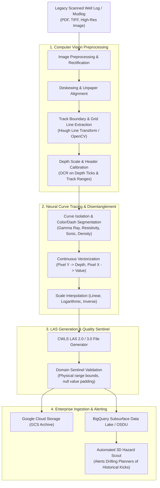

# Agent Idea: Scanned Well Logs & Mudlogs to .LAS Digitization Agent

> **Persona Alignment:** **`P04 · Petrophysicist`** (Formation Evaluation & Well Log Ingestion)  
> **Secondary Beneficiaries:** **`P23 · Subsurface Data Manager`** (Data Governance) & **`P07 · Drilling Engineer`** (Offset Hazard Scout)  
> **Origin in Repositories:** Identified in `O&G_slidedeck_agentic_transformation` as **`Agent 01: PDF-to-LAS & BigQuery Agent`** / **`Offset Hazard Mudlog Scout (Cell C6)`**, and in `value_terrain_10x10_build.md` as **`Dark Data LAS Crawling & Retrieval (P02-W01)`**.

---

## 1. Executive Summary & Problem Context

In upstream Oil & Gas exploration and production, decades of historical borehole data (offset wellbores, exploration wells, appraisal mudlogs) exist only as **unstructured scanned raster files** (flat PDFs, TIFF images, or digitized microfiche).

### The Real-World Operational Vulnerability
* **The "Dark Data" Trap**: A 2004 offset well drilled 3 km away from a proposed drill site recorded a major high-pressure gas kick or borehole collapse at 3,250 meters. That warning was trapped inside an unscanned or unindexed PDF mudlog in a legacy archive.
* **The Handover Failure**: Because standard engineering software (SLB Petrel, Techlog, Landmark Compass) cannot parse flat PDF pictures, well planners plan infill wells blind to historical mudlog anomalies.
* **The Catastrophic Cost**: The drill bit penetrates the unmapped fracture or gas pocket, resulting in gas kicks, differential stuck pipe, weeks of fishing operations, and **₹50+ Cr to ₹70+ Cr in Non-Productive Time (NPT)**.

---

## 2. Core Comparison: Manual Drafting vs. Autonomous Agent

| Capability | Manual Drafting / Traditional Digitizing | Autonomous PDF-to-LAS Agent |
| :--- | :--- | :--- |
| **Throughput** | 2 to 4 days per well log (manual line tracing) | **Sub-minute execution** (seconds per run) |
| **Grid Calibration** | Manual point clicks on track axes | Automatic gridline detection & perspective correction |
| **Scale Support** | High risk of human error on logarithmic scales | Rigorous mathematical mapping (log 0.2–2000, linear 0–150) |
| **Curve Disentanglement** | Operator struggles when curves cross in same track | Deep vision segmentation (color, dash pattern, stroke) |
| **Output Standardization** | Inconsistent curve names and units | **CWLS LAS 2.0 / 3.0** with SPWLA standardized mnemonics |
| **Integration** | Stored on local desktop hard drives | Auto-uploaded to **GCS**, indexed in **BigQuery** & **OSDU** |

---

## 3. End-to-End System Architecture



---

## 4. Key Technical Capabilities

### 4.1. Grid & Track Detection
* Well logs use standardized SPWLA track formats (e.g., Track 1 linear 0–150 GAPI for Gamma Ray; Track 2 logarithmic 0.2–2000 $\Omega\cdot\text{m}$ for Deep Resistivity; Track 3 linear for Porosity / Density).
* The agent identifies horizontal depth gridlines and vertical decade gridlines, constructing a dynamic pixel-to-depth transformation matrix that handles paper stretch and nonlinear scanner distortion.

### 4.2. Multi-Curve Vectorization & Disentanglement
* Scanned logs frequently have overlapping curves plotted across the same track (e.g., Caliper, Bit Size, and Gamma Ray in Track 1; Shallow, Medium, and Deep Resistivity in Track 2).
* The agent separates curves based on:
  1. Stroke style (solid, dashed, dotted, dash-dot).
  2. Color channel filtering (red, blue, black, green ink).
  3. Continuous contour tracking with physics priors (well log curves cannot jump discontinuously without physical rock transitions).

### 4.3. Standardized CWLS LAS Output
Generates compliant **Log ASCII Standard (LAS)** files:
```text
~VERSION INFORMATION
 VERS.                          2.0 : CWLS LOG ASCII STANDARD - VERSION 2.0
 WRAP.                           NO : ONE LINE PER DEPTH STEP
~WELL INFORMATION
 STRT .M                   3200.000 : START DEPTH
 STOP .M                   3550.000 : STOP DEPTH
 STEP .M                      0.150 : STEP
 NULL .                   -999.2500 : NULL VALUE
 WELL .             BARMER_OFFSET_04: WELL NAME
~CURVE INFORMATION
 DEPT .M                            : MEASURED DEPTH
 GR   .GAPI                         : GAMMA RAY
 RDEP .OHMM                         : DEEP RESISTIVITY
 RHOB .G/C3                         : BULK DENSITY
 NPHI .V/V                          : NEUTRON POROSITY
 CALI .IN                           : CALIPER
~ASCII DATA
 3200.000   45.2   12.4   2.45   0.18   8.52
 3200.150   46.1   12.8   2.44   0.18   8.51
 ...
```

### 4.4. Automated Mudlog Hazard Scout
* Beyond wireline curves, it OCRs unstructured mudlog remarks (e.g., *"Connection gas 120 units at 3,252m"*, *"Lost circulation 40 bbls/hr at 3,280m"*).
* Geotags and depth-tags hazard events directly into BigQuery, flagging 3D spatial collision risks during trajectory design of new infill wells.

---

## 5. Enterprise Impact & Economic Metrics

Based on the strategic enterprise matrix models:
* **Capital Risk Avoided**: Up to **₹70 Cr per occurrence** by preventing drillstring pack-offs, gas kicks, and unplanned well sidetracks.
* **Cycle Time Reduction**: **5 seconds vs. 4 days** for historical well log digitization and accessibility.
* **Data Foundation**: Transforms dark, dormant paper archives into active ML-ready assets for regional petrophysical modeling and autonomous curve splicing agents.

---

## 6. Implementation Tech Stack

| Layer | Tools & Frameworks | Function |
| :--- | :--- | :--- |
| **Image & Geometry** | `OpenCV`, `scikit-image`, `unpaper` | Deskewing, morphological filtering, gridline extraction |
| **Vision & Tracing** | PyTorch / YOLOv8 / SAM + Gemini Vision | Curve detection, stroke classification, legend OCR |
| **Log Processing** | `lasio`, `welly`, `numpy`, `scipy` | Calibration interpolation, curve smoothing, LAS formatting |
| **Cloud Infrastructure** | Google Cloud Storage (GCS), BigQuery, Cloud Run | Ingestion bucket trigger, microservice compute, database indexing |
| **Domain Standards** | SPWLA, CWLS LAS 2.0/3.0, OSDU | Nomenclature and schema conformance |
