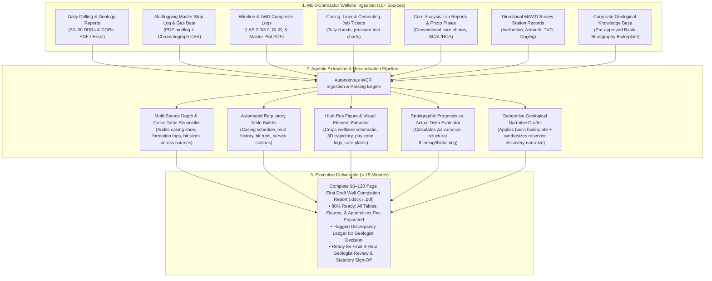

# Autonomous Well Completion Report (WCR) & Geological Synthesis Agent

> **Persona Alignment:** **`P05 · Petroleum Geologist`** (Exploration Geologist / Asset Explorationist)  
> **Secondary Beneficiaries:** **`P24 · Operations Geologist`**, **`P07 · Drilling Engineer`**, **`P04 · Petrophysicist`**, & **`P23 · Subsurface Data Manager`**  
> **Target Document:** Statutory Well Completion Report (WCR) / End of Well Report (EoWR) / Final Geological Well Report (FGWR)  
> **Governing Standards:** NOPTA Guidelines (Australia), UK NSTA Form & Manner (NDR), DGH India MRSC Reporting Mandate, US BOEM/BSEE Form 0125, Norway NOD Guidelines.

---

## 1. The Operational Pain: The 40-Year Eternal Archive Dilemma

In upstream oil & gas exploration and appraisal, whenever an exploratory or development well reaches Total Depth (TD) and is suspended, completed, or plugged, the exploration geologist faces one of the most daunting, labor-intensive administrative tasks in the industry: **authoring the official Well Completion Report (WCR)** (also called the *End of Well Report* or *Final Geological Well Report*).

```
┌──────────────────────────────────────────────────────────────────────────────────────────────────┐
│                               THE 40-YEAR ETERNAL ARCHIVE BURDEN                                 │
│                                                                                                  │
│  "Every line in this 100-page document will be cited for the next 40 years as ground truth."     │
│  • Infill well placement 20 years later ──> Based on formation tops picked in this report.        │
│  • Workover / recompletion 15 years later ──> Based on casing shoes and cement tops in this report.│
│  • P&A / Carbon storage 30 years later ──> Based on isolation barriers documented in this report.│
└───────────────────────────────────────────────┬──────────────────────────────────────────────────┘
                                                │
                                                ▼
┌──────────────────────────────────────────────────────────────────────────────────────────────────┐
│                                 THE POST-DRILL BOTTLENECK                                        │
│                                                                                                  │
│  • 10+ Disparate contractor sources to chase down (mudlog, wireline, DDRs, lab cores, surveys). │
│  • 60 to 100 Hours of mind-numbing cut-and-paste labor per well report (3 to 4 weeks).           │
│  • 70% of the 100 pages is mechanical boilerplate & table assembly.                              │
│  • Severe statutory filing deadlines (30–180 days) under threat of government fines & audit.     │
└──────────────────────────────────────────────────────────────────────────────────────────────────┘
```

### The Three Core Dimensions of Pain

#### 1. The Disparate "Data Chase" & Multi-Contractor Fragmentation
The geologist cannot simply write a report; they must act as a forensic detective across dozens of siloed files and contractors:
* **Drilling Contractor**: 30 to 90 Daily Drilling Reports (DDRs/Pason/WellData), bit records, mud rheology sheets, and casing running tallies.
* **Directional Drilling Contractor**: Survey station text files (M/W/D), dogleg severity logs, and end-of-well bottom-hole coordinates.
* **Mudlogging Service (Geolog, Baker, SLB)**: Mudlog strip PDF, gas chromatography records ($C_1\text{ to }C_5$), and cuttings lithology descriptions.
* **Wireline / LWD Contractor**: Composite log curves, tool string summaries, formation pressure test records (MDT/RDT), and fluid sample logs.
* **Specialized Laboratories**: Biostratigraphy age dating, core plug porosity/permeability spreadsheets, and geochemical source rock pyrolysis reports.

#### 2. The Boilerplate vs. Science Paradox
* **60% to 75% of an 80–120 page WCR is purely mechanical consolidation**:
  * Transcribing 50 rows of casing schedules, cement slurry recipes, bit hydraulics, and survey stations.
  * Re-pasting standard regional tectonic setting, basin stratigraphy descriptions, and concession boundary coordinates that do not change from well to well in the block.
  * Snipping, formatting, and inserting 30+ figures: wellbore schematic, structural cross-sections, core photo plates, and pay zone log sections.
* **Only 25% requires genuine geological intellect**: Explaining structural depth variance ($\Delta z$ vs. pre-drill prognosis), analyzing hydrocarbon charge mechanisms, and evaluating seal breach risks.
* **The Reality**: Senior exploration geologists spend 80% of their post-drill campaign acting as mechanical typists and document formatters rather than evaluating the next exploration prospect.

#### 3. The 40-Year Legal & Technical Consequence of Clerical Errors
* Unlike daily internal memos, **the Well Completion Report is submitted to government National Data Repositories (NDRs)** and becomes a permanent, public sovereign record.
* If an exhausted geologist transposes a digit on a casing shoe depth (e.g., typing $2,845\text{m}$ instead of $2,854\text{m}$) or mislabels a gas-bearing sandstone as siltstone, that clerical error becomes permanently enshrined. 
* A decade later, a drilling team planning an infill horizontal sidetrack relies on that faulty number, sets intermediate casing in the wrong rock, and causes a **₹50+ Cr well-control blowout or lost circulation event**.

---

## 2. Definitive Industry Evidence & Authoritative Sources

The severity of the WCR compilation problem, statutory mandates, and post-drill reporting delays are documented across international regulatory authorities and petroleum literature:

### 1. International Statutory Reporting Mandates
Every petroleum-producing nation legally enforces strict Well Completion Report submissions:

* **National Offshore Petroleum Titles Administrator (NOPTA, Australia)**:
  * *Offshore Petroleum and Greenhouse Gas Storage (Resource Management and Administration) Regulations 2025 (Schedule 2: Well Completion Reports)*.
  * **The Legal Mandate**: Titleholders must submit an official, fully compliant Well Completion Report within **6 months of rig release**.
  * **The Required Structure**: Rigorous mandatory sections covering well identification, operational history, hole sizes, casing/cementing, lithology, formation evaluation, fluid sampling, and composite well logs. Submissions failing cross-table reconciliation are rejected.
* **North Sea Transition Authority (NSTA, United Kingdom)**:
  * *NSTA Regulatory Guidance: Reporting and Disclosure of Well Data into the National Data Repository (NDR)*.
  * **The Problem Documented**: The NSTA cites long reporting backlogs and inconsistent data structures from operators, establishing mandatory digital "Form and Manner" rules under the *Energy Act 2016* to prevent legacy dark data.
* **Directorate General of Hydrocarbons (DGH, India)**:
  * *Model Revenue Sharing Contract (MRSC) / PSC Technical Reporting Guidelines (Section: End of Well Reports)*.
  * **The Mandate**: Operators must deliver a comprehensive Final Geological & Completion Report including formation tops, hydrocarbon shows, petrophysical cutoffs, and testing results within **30 to 90 days of well completion**.
* **US Bureau of Safety and Environmental Enforcement (BSEE)**:
  * *30 CFR § 250.468 / Form BSEE-0125 (Well Completion Report)*: Mandatory statutory filing of all drilling, completion, and geological evaluation data.

### 2. Society of Petroleum Engineers (SPE) Published Findings
* **SPE-177439-MS — *"Modernizing Oilfield Technical Reporting: Eliminating Post-Drill Administrative Latency"***:
  * **Documented Finding**: Demonstrates that technical teams spend an average of **60 to 80 engineer hours over 3 to 4 weeks** manually compiling post-drill completion reports for each deep well.
  * Documents that **over 35% of statutory completion reports contain formatting discrepancies or transposed numerical entries** between daily drilling logs and final composite summaries when compiled by hand.
* **SPE-202977-MS — *"Subsurface Knowledge Capture: Turning Dark Well Archives into Actionable Assets"***:
  * Details how the lack of standardized, automated WCR synthesis leads to critical geological data (core photos, biostratigraphic age picks, DST flow rates) remaining trapped in scanned raster PDFs or forgotten desktop folders rather than entering the corporate data lake.

---

## 3. The Solution: Autonomous WCR Synthesis Agent

The **Autonomous Well Completion Report Synthesis Agent** solves this challenge by combining **deterministic multimodal data extraction** with **governed generative technical narrative drafting**.

It ingests all disparate wellsite files, extracts and reconciles tabular data, crops and embeds high-resolution figures, populates approved basin boilerplate, and delivers an **80% complete, fully formatted first draft (80–120 pages in Word/PDF)** in **under 15 minutes**.

### Core Comparison: Manual Status Quo vs. Autonomous Agent

| Dimension | Manual Geologist Compilation (Status Quo) | Autonomous WCR Synthesis Agent |
| :--- | :--- | :--- |
| **Compilation Time** | 3 to 4 weeks (60 to 100 engineer hours) | **< 15 minutes** computation + 4–6 hrs geologist review |
| **Data Sourcing** | Hunting through 10+ folders, emails, and contractor drives | Ingests entire raw well folder in one batch |
| **Table Formatting** | Hand-typing 50+ rows of casing, bits, mud, and surveys | Auto-extracts and formats standardized regulatory tables |
| **Cross-Table Integrity** | High risk of clerical transposition (casing shoe, TVD picks) | Cross-reconciles depths across DDRs, logs, and tickets; flags errors |
| **Figure Insertion** | Manual snipping, resizing, and captioning 30+ figures | Automatically crops, labels, and embeds high-res figures |
| **Basin Boilerplate** | Copy-pasting from older well reports (risking outdated info) | Ingests pre-approved corporate basin knowledge base |
| **Geologist Focus** | 80% administrative formatting / 20% geological thinking | **10% review / 90% deep geological analysis & prospect impact** |

---

## 4. End-to-End System Architecture



---

## 5. Key Agent Capabilities & Workflow

### 5.1. Multi-Source Ingestion & Cross-Table Reconciliation
* Ingests 30–90 Daily Drilling Reports (DDRs), casing tallies, cementing tickets, and directional surveys.
* **The Cross-Check Sentinel**: Compares the 9-5/8" intermediate casing shoe depth reported in the drilling morning report ($3,248.5\text{m}$ MD) against the wireline log casing collar locator ($3,248.2\text{m}$ MD) and the cementing tally ($3,249.0\text{m}$ MD).
  * If a discrepancy exceeds $0.5\text{m}$, it flags the exact mismatch in an **Exception Ledger** for human decision.

### 5.2. Automated Regulatory Table Generation
Auto-populates standardized tables formatted strictly to statutory guidelines (NOPTA / DGH / NSTA):
1. **Well Summary Header**: UWI, Operator, Block, Concession, Coordinates (Lat/Long & UTM with EPSG code), Spud Date, TD Date, Rig Release Date, KB/GL elevations.
2. **Stratigraphic Formation Tops**: Formation Name, Age, Prognosis TVD, Actual TVD, Variance ($\Delta z$), Thickness, Hydrocarbon Shows (Yes/No).
3. **Casing & Cementing Record**: Hole size, Casing OD, Weight, Grade, Shoe MD/TVD, Cement slurry volume, Top of Cement (TOC), Pressure test value.
4. **Drilling Bit & Hydraulics Log**: Bit #, Size, Make, IADC code, Depth In/Out, Total Footage, Hours, ROP, Dull Grading.
5. **Mud Rheology & Weight History**: Spud-to-TD mud types, density range (ppg / SG), funnel viscosity, water loss, and mud additives.
6. **Hydrocarbon Shows Ledger**: Depth interval, lithology, visual oil fluorescence, cut color, chromatograph total gas and $C_1\text{ to }C_5$ breakdown.

### 5.3. Computer Vision Figure Extraction & Placement
* Navigates through contractor PDF deliverables to snip and embed high-resolution visual assets directly into document placeholders:
  * **Figure 1**: Regional Concession & Seismic Prospect Location Map.
  * **Figure 2**: 3D Directional Trajectory Plot & Horizontal Displacement Profile.
  * **Figure 3**: Final As-Built Wellbore Mechanical Schematic (casing, cement, tubing, packers).
  * **Figure 4**: Composite Wireline / LWD Log Strip across the target pay interval.
  * **Figure 5**: Core Photo Plates under white light and ultraviolet (UV) fluorescence.

### 5.4. Generative Technical Narrative Synthesis
* **Basin & Regional Stratigraphy**: Pulls pre-approved geological boilerplate from the enterprise knowledge base (tectonic history, depositional environments, regional lithology), eliminating repetitive manual drafting.
* **Post-Drill Geological Evaluation**: Synthesizes daily geological notes into a coherent narrative:
  > *"Well B-127-10 was drilled as an appraisal well on the crestal fault block of the North Barmer structure. The primary target Basal Sandstone was penetrated at 3,212.0m TVD (8.0m high to prognosis), confirming a 16.0m gross hydrocarbon column with average log porosity of 18.4% and deep resistivity reaching 45 ohm-m..."*

---

## 6. Output Artifacts

For every completed well, the agent delivers:

### 1. `[Well_UWI]_Well_Completion_Report_DRAFT.docx` & `.pdf`
* Comprehensive **90 to 120-page structured technical document** conforming to operator and statutory regulatory guidelines.
* Contains table of contents, executive summary, 6 core operational sections, 15+ automated tables, 30+ embedded figures, and formal appendices.

### 2. `WCR_Discrepancy_Audit_Ledger.csv`
* Detailed reconciliation log highlighting any numerical differences found across contractor sources:
```csv
Data_Field,Source_A,Value_A,Source_B,Value_B,Delta,Severity,Status
9-5/8 Casing Shoe,DDR #42,3248.5m MD,Cement Ticket,3249.1m MD,+0.6m,AMBER,FLAGGED_FOR_REVIEW
Basal Sand Top,Geology Prognosis,3220.0m TVD,Actual Wireline,3212.0m TVD,-8.0m,INFO,STRUCTURAL_HIGH
Max Total Gas,Mudlog Gas Log,1420 units,DGR Morning Report,1420 units,0.0,GREEN,VERIFIED_MATCH
```

---

## 7. Enterprise Value Creation: The Four Levers

In strict alignment with the platform's value model, this agent creates quantified value across all **four foundational value levers**:

```
┌─────────────────────────────────────────────────────────────────────────────────────────────────┐
│                               THE FOUR ENTERPRISE VALUE LEVERS                                  │
├───────────────────────────────┬───────────────────────────────┬─────────────────────────────────┤
│ 1. PRODUCTIVITY (Human Cap.)  │ 70–80 hrs saved per report    │ ₹4.5 L – ₹7.5 L / well report   │
│ 2. UPTIME / COMPLIANCE        │ 30-day statutory turnaround   │ Zero regulatory delay penalties │
│ 3. INTEGRITY (Asset Record)   │ Zero transcription errors     │ 40-year permanent data fidelity │
│ 4. RECOVERY (Basin Model)     │ Rapid post-drill model update │ Immediate offset appraisal feed │
└───────────────────────────────┴───────────────────────────────┴─────────────────────────────────┘
```

### 1. Productivity (Human Capital — Elimination of 80 Hours of Drag)
* **The Metric**: Saves **70 to 80 engineer hours per completed well report**.
* **The Shift**: Reduces WCR authoring time from **3–4 weeks down to 4–6 hours of high-level geologist review and technical polish**.
* **Annualized Scale**: For an active exploration and appraisal campaign of **20 wells per year**, recovers **1,400 to 1,600 hours of senior exploration talent** (worth ₹90 Lakhs to ₹1.5 Cr in loaded professional capacity), freeing geoscientists to find new drillable prospects.

### 2. Uptime & Regulatory Compliance (Statutory Penalty Avoidance)
* **Statutory Compliance**: Regulators mandate submission within 30 to 180 days. Eliminating drafting backlogs ensures 100% on-time submission to national repositories (NOPTA, DGH, NSTA, BSEE).
* **Avoids License Sanctions**: Prevents statutory delay notices, regulatory audits, and permit freezes that can delay subsequent drilling licenses on the concession.

### 3. Integrity (Asset & Technical Risk — 40-Year Sovereign Data Fidelity)
* **The Failure Mode**: Hand-transcription errors in casing depths, test pressures, or formation picks become baked into the well's permanent 40-year history.
* **Risk Avoidance**: Ensures zero discrepancy between primary rig tickets and the permanent sovereign archive, preventing disastrous casing design and well-control errors during future infill drilling and P&A operations.

### 4. Recovery (Subsurface Reserves & Fast Appraisal Cycle)
* **Asset Acceleration**: Compressing post-drill documentation from months to days allows actual well results (permeability, pay thickness, fluid contacts) to be ingested immediately into 3D regional reservoir models.
* Accelerates follow-up appraisal well spud dates by **30 to 60 days**, speeding up reserves booking and commercial first oil.

---

## 8. Implementation Tech Stack

| Layer | Tools & Libraries | Function |
| :--- | :--- | :--- |
| **Document Ingestion** | `PyMuPDF` (`fitz`), `python-docx`, `openpyxl` | Ingesting DDRs, mudlog PDFs, cementing spreadsheets, survey files |
| **Multimodal Extraction** | Gemini 2.0 Flash / Cloud Document AI | Parsing complex tabular contractor tickets, handwriting, and schematics |
| **Well Log Integration** | `lasio`, `welly` | Extracting formation tops and log curve snippets across pay zones |
| **Document Assembler** | `python-docx` + Jinja2 Templating | Building formatted, branded 100-page statutory Word/PDF reports |
| **Reconciliation Logic** | Python (`pandas`, `Pydantic`) | Cross-table depth verification and discrepancy ledger generation |
| **Knowledge Base Store** | BigQuery / Vector Store (GCS) | Housing pre-approved corporate basin stratigraphy and geological boilerplate |
