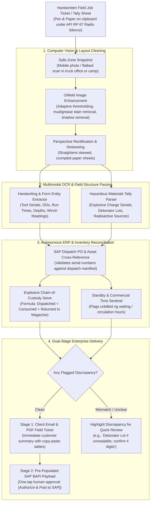

# Autonomous Field Paper Job Ticket & Explosives Tally to SAP/ERP Agent

> **Persona Alignment:** **`P34 · Well Logging Engineer`** (Field Operations / Rig-Floor Wireline & Perforating Specialist)  
> **Key Counterparts:** **`P01 · Wellsite Supervisor (Company Man)`** (Approver of Field Tickets) & **Enterprise Supply Chain / Billing Team**  
> **Governing Standards:** API RP 67 (Oilfield Explosives Safety), HERO (Hazards of Electromagnetic Radiation to Ordnance), OSHA 1910.109, ATF / PESO Explosive Chain of Custody, SAP PM / MM Modules.

---

## 1. Executive Summary: The Post-Marathon Administrative Trap

In oilfield wireline logging, well intervention, and perforating operations, the physical job on the rig floor is governed by life-critical safety protocols. Whenever explosive perforating guns, detonators, or radioactive logging sources (Cesium-137, Americium-241/Beryllium) are handled, armed, or deployed across the rig floor:

> **All electronic devices—cell phones, tablets, laptops, Wi-Fi hotspots, and two-way radios—are strictly prohibited under API RP 67 Radio Silence / HERO protocols to prevent accidental detonation from stray RF radiation.**

```
┌──────────────────────────────────────────────────────────────────────────────────────────┐
│                             THE DRILL FLOOR REALITY                                      │
│                                                                                          │
│  [API RP 67 Radio Silence Enforced]  ──>  No laptops, no iPads, no digital logging.     │
│  Rig Floor Electrical Power Isolated ──>  Handwritten tally sheets on clipboards.        │
└────────────────────────────────────────────┬─────────────────────────────────────────────┘
                                             │
                                             ▼
┌──────────────────────────────────────────────────────────────────────────────────────────┐
│                            THE 24-HOUR POST-JOB DRAIN                                    │
│                                                                                          │
│  12–24 Hours on Tour on the Rig Floor  ──>  Exhausted return to logging camp / trailer. │
│  "Running a mile after finishing a marathon" ──> Manual transcription into SAP (45–60m)  │
│  Grease/mud-smudged paper  ──> Clerical errors, misplaced serials, disputed invoices.    │
└──────────────────────────────────────────────────────────────────────────────────────────┘
```

### The Operational Vulnerability
1. **The Compulsory Pen & Paper Clipboard**:
   * On the cat-walk, lubricator, and drill floor, the field engineer and winch operator must record everything by hand: tool string serial numbers, lengths, outer diameters (OD), radioactive source IDs, explosive batch numbers, gun firing confirmations, line tension, depths, and rig arrival/standby times.
2. **The "Running a Mile After a Marathon" Fatigue**:
   * Wireline jobs routinely require **12 to 24+ hours of continuous physical duty** in extreme weather (North Sea freezing cold or desert heat).
   * Returning to the logging base or bunkhouse completely drained, the engineer must spend another **45 to 60 minutes** manually keying smudged, oil-stained, crumpled handwritten figures into complex enterprise ERP systems (**SAP Plant Maintenance, SAP Materials Management, Service Orders** or contractor portals like SLB FTL, Halliburton SAP, Baker Hughes Maximo).
3. **High-Consequence Failure Modes**:
   * **Explosive Inventory Discrepancy**: A transposed digit in a perforating charge lot number or missing detonator serial violates federal explosive regulations (ATF / PESO / statutory mining bureaus), leading to immediate regulatory investigation or suspended operating licenses.
   * **Revenue Leakage**: An exhausted engineer forgets to log 4.5 hours of rig standby while waiting on the operator's mud circulation, forfeiting **₹3,00,000 to ₹10,00,000** in billable waiting time.
   * **Invoice Dispute Lag**: Illegible handwriting on paper tickets leads to customer accounting disputes, delaying billing cycles and cash collection by **15 to 45 days**.

The **Autonomous Field Paper Job Ticket & Explosives Tally to SAP/ERP Agent** bridges this gap. Once back in an electronic-safe zone, the engineer simply snaps a photo of the clipboard ticket. The agent enhances the image, performs structured handwriting OCR, cross-references digital dispatch orders, verifies explosive mass-balance, outputs a formatted customer email, and pre-populates the SAP BAPI/RFC payload for one-click authorization: **`[Authorize & Submit to SAP]`**.

---

## 2. Definitive Industry Evidence & Authoritative Sources

The mandatory prohibition of electronics during explosive wireline operations and the resulting administrative friction are codified across industry literature and statutory regulations:

### 1. API Recommended Practice 67 (API RP 67) — *Oilfield Explosives Safety*
* **Section 4.3 ("Radio Frequency (RF) Safety & Electromagnetic Radiation")**:
  > *"Radio transmitters, cellular telephones, portable electronic transceivers, and cathodic protection systems represent serious potential ignition hazards for electro-explosive devices (EEDs)... Strict Radio Silence shall be enforced from the time perforating guns are brought to the wellhead until guns are at a safe depth below ground level or mudline."*
* **Section 8.1 ("Explosive Inventory Custody & Consumption Records")**:
  Mandates exact physical record-keeping of explosive counts (part numbers, detonator lot numbers, charge quantities) from magazine dispatch to wellsite consumption and return.

### 2. Hazards of Electromagnetic Radiation to Ordnance (HERO Protocols)
* **Citation**: *DoD / NATO HERO Guidelines & IADC Drilling Safety Manual (Section: Wireline Explosives)*.
* **Documented Reality**: Stray RF energy from consumer electronics or rig-floor radios can induce current in electrical blasting cap leg wires exceeding the 50 mW / 0.2A maximum no-fire current (MNFC), causing uncommanded surface detonations.

### 3. Society of Petroleum Engineers (SPE) Operations Literature
* **SPE-177439-MS — *"Modernizing Oilfield Service Ticketing: Eliminating Administrative Friction and Billing Disputes"***:
  * Demonstrates that over **22% of oilfield service field tickets contain clerical transcription errors** (transposed asset serials, missing standby times, incorrect depth intervals) when manually converted from paper to enterprise ERP systems.
  * Shows that transitioning to automated vision-based field ticket capture cuts invoicing disputes by **83%** and compresses billing cycle latency from **14 days to under 2 hours**.
* **SPE-124151-MS — *"Enhancing Wireline Perforating Safety and Regulatory Compliance through Automated Chain of Custody"***:
  * Details how manual paperwork post-shift leads to missing explosive consumption manifests, triggering severe regulatory audits and fines from statutory explosive control directorates.

### 4. Enterprise ERP Realities in Major Operators & Service Contractors
* **SLB, Halliburton, Baker Hughes, ONGC, and Saudi Aramco Operating Frameworks**:
  * Every wireline operation must produce two mandatory digital outputs in ERP:
    1. **Service Order Confirmation / Field Ticket**: Billed operational hours, rig standby, tool rental items, and mileage.
    2. **Goods Issue (e.g., SAP Movement Type 261)**: Immediate de-stocking of consumed hazardous explosives and radioactive assets.

---

## 3. Core Comparison: Manual Clipboard Transcription vs. Autonomous Agent

| Dimension | Manual Post-Shift Entry (Status Quo) | Autonomous Field Paper-to-SAP Agent |
| :--- | :--- | :--- |
| **Field Capture Environment** | Strictly pen & paper on clipboard (Radio Silence) | Preserves pen & paper on rig floor (Zero RF risk) |
| **Post-Shift Burden** | 45 to 60 minutes of manual typing into SAP | **< 30 seconds** (snap photo, review, tap authorize) |
| **Exhaustion State** | Done after 18–24 hours of grueling physical labor | Agent executes instantly regardless of shift duration |
| **Image Imperfections** | Grease stains, mud splatters, folded paper make it illegible | CV filters remove mud smudges, enhance contrast, deskew |
| **Explosive Audit Balance** | Mental math: Dispatched vs. Fired vs. Returned | Automated formulaic validation: `Dispatched == Fired + Returned` |
| **Rig Standby Capture** | Often forgotten or omitted in haste | Cross-checks rig log to ensure all standby hours are billed |
| **Customer Distribution** | Scanned PDF emailed days later; disputes common | Instant clean digital PDF + formatted text generated on-site |
| **ERP Integration** | Manual keying across multiple SAP GUI screens | Auto-generates structured JSON / BAPI payload ready for submission |

---

## 4. End-to-End System Architecture



---

## 5. Key Agent Capabilities

### 5.1. Harsh-Environment Computer Vision Preprocessing
* Field tally sheets are rarely pristine office documents; they suffer from engine oil smudges, drilling mud splatters, coffee rings, and crumpled paper creases.
* The agent applies morphological filtering, adaptive Sauvola binarization, and perspective transforms to strip surface grease artifacts and straighten warped clipboard photos into high-contrast documents.

### 5.2. Multimodal Handwriting & Oilfield Domain Entity Parsing
* Specifically tuned for oilfield shorthand and wireline equipment nomenclature:
  * **Tool Codes & Dimensions**: Identifies `GR-CCL` (Gamma Ray / Casing Collar Locator), `PLUG-4.50"`, `GUN-3.125"`, `O.D.`, `LENGTH`, `SERIAL #`.
  * **Operational Timestamps**: Parses 24-hour time entries (`02:15 Rig Up Lubricator`, `04:30 RIH`, `07:15 POOH`, `09:00 Rig Down`).
  * **Winch & Cable Dynamics**: Extracts Maximum Tension (`3,450 lbs`), Tool Zero Depth, Target Depth (`3,248.5m`), and Cable Speed.

### 5.3. Explosive Mass-Balance & Statutory Compliance Engine
* Automatically verifies strict chain-of-custody for hazardous materials per **API RP 67**:
  $$\text{Dispatched from Base} \equiv \text{Charges Fired Downhole} + \text{Live Charges Returned to Magazine}$$
* If 48 shaped charges were dispatched and the handwritten tally shows 40 charges fired across two gun runs, it verifies that **8 unfired charges** are explicitly cataloged as returned to the transport explosive box.
* Reconciles radioactive source IDs (e.g., Cs-137, $1.7\text{ Ci}$) against valid leak-test certificates.

### 5.4. SAP BAPI / ERP Payload Assembly
* Transforms raw field data directly into enterprise business objects:
  * **SAP PM / CS Service Notification / Confirmation**: Time entries mapped to work centers.
  * **SAP MM Goods Issue (Movement 261)**: Auto-populates consumed consumable materials (perforating charges, detonating cords, O-ring redress kits).
  * **Commercial Waiting Time Tracker**: Compares rig arrival vs. tool in-hole times against contractual allowable window, calculating billable rig standby hours.

---

## 6. Output Artifacts

### A. Instant Client Summary Email & Digital Field Ticket
* Generates a branded digital PDF ticket and clean markdown tables for immediate client email distribution:
```text
========================================================================================
                   WIRELINE & PERFORATING SERVICE FIELD TICKET
========================================================================================
OPERATOR: ONGC WESTERN OFFSHORE       RIG: SAGAR JYOTI (OFFSHORE JACKUP)
WELL: B-127-10                        DATE: 2026-09-13
WIRELINE UNIT: WU-04                  LOGGING ENGINEER: P34 FIELD CREW
----------------------------------------------------------------------------------------
RUN BREAKDOWN:
• Run 1: 3-1/8" Scallop Perforating Guns (Interval: 2,840.0m - 2,848.5m)
  - Charges Fired: 48 / 48 (100% Confirmation via CCL & Tension Drop)
  - Detonator Lot: DET-2026-9941 (Checked & Reconciled)
• Run 2: 4-1/2" Cast Iron Bridge Plug (Setting Depth: 2,855.0m)
  - Setting Tool: Baker #10 E-4 Setting Assembly (Serial: WLS-8841)

TIMELINE & COMMERCIAL SUMMARY:
• Rig Up / Pressure Test PCE: 02:00 - 04:00 (2.0 hrs)
• In-Hole Operations:          04:00 - 08:30 (4.5 hrs)
• Operator Waiting on Mud:     08:30 - 11:30 (3.0 hrs) --> [BILLABLE RIG STANDBY]
• Rig Down & Demob:            11:30 - 12:30 (1.0 hr)
----------------------------------------------------------------------------------------
STATUS: PRE-VALIDATED // READY FOR SAP COMMIT
[ CLICK TO AUTHORIZE & POST TO SAP ]  or  [ EXPORT CLIENT PDF ]
========================================================================================
```

### B. Structured SAP Payload (JSON / BAPI)
* Pre-assembled data ready to push directly into SAP RFC / REST endpoints upon engineer authentication:
```json
{
  "sapModule": "PM_SERVICE_CONFIRMATION",
  "purchaseOrder": "4500981244",
  "workOrder": "000100482910",
  "wellUWI": "IN-ONGC-B127-10",
  "billableStandbyHours": 3.0,
  "materialsConsumed": [
    {"materialCode": "EXP-CHG-3125", "quantity": 48, "unit": "EA", "lot": "CHG-0914"},
    {"materialCode": "DET-EED-01",   "quantity": 2,  "unit": "EA", "lot": "DET-2026-9941"}
  ],
  "explosiveReconciliation": "BALANCED_ZERO_DISCREPANCY"
}
```

---

## 7. Enterprise Value Creation: The Four Levers

In strict accordance with the platform's value architecture, this agent delivers value across all **four foundational value levers**:

```
┌─────────────────────────────────────────────────────────────────────────────────────────────────┐
│                               THE FOUR ENTERPRISE VALUE LEVERS                                  │
├───────────────────────────────┬───────────────────────────────┬─────────────────────────────────┤
│ 1. PRODUCTIVITY (Human Cap.)  │ Post-Shift Data Entry Saved   │ 1.0 hr saved / job (450 hrs/yr) │
│ 2. UPTIME (Billing Velocity)  │ Unbilled Standby Recaptured   │ ₹3.0 L – ₹10.0 L / campaign     │
│ 3. INTEGRITY (Asset & Law)    │ Explosives Audit Fines Avoided│ ₹25.0 L – ₹1.0 Cr risk avoid.   │
│ 4. RECOVERY (Intervention)    │ Verified Perforation Placement│ Zero depth-mismatch replugs     │
└───────────────────────────────┴───────────────────────────────┴─────────────────────────────────┘
```

### 1. Productivity (Human Capital — Post-Shift Administrative Elimination)
* **The Relief Factor**: Wireline field engineers frequently work 18–24 hours on their feet in hazardous conditions. Eliminating 45–60 minutes of tedious manual typing at 4:00 AM directly prevents burnout and employee turnover.
* **Quantified Hours**: Across a field district operating 450 wireline runs annually, returns **450 hours of engineer time**, allowing crews to achieve mandatory safety rest hours faster.

### 2. Uptime (Commercial & Asset Capital — Unbilled Standby Recaptured)
* **The Commercial Leak**: In the haste to finish paperwork, exhausted engineers frequently fail to document operator-driven rig delays (e.g., waiting on mud conditioning, crane unavailability, safety meetings).
* **Net Value Recovered**: Capturing an average of 2 unbilled standby hours across 20% of jobs recaptures **₹3,00,000 to ₹10,00,000 per field campaign** in legitimate contract revenue that otherwise leaks.
* **Cash Flow Velocity**: Compresses invoice generation from **14 days to under 2 hours**, eliminating billing dispute cycles.

### 3. Integrity (Statutory & Legal Risk — Zero-Defect Explosive Tracking)
* **The Compliance Shield**: Mismatched serial numbers or discrepancies in explosive accounts trigger immediate statutory audits by national agencies (PESO, ATF, DGMS) with penalties ranging from **₹25 Lakhs to over ₹1 Crore**, including potential license suspension.
* **Audit Trail**: Generates a tamper-proof digital paper trail matching physical clipboard signatures with ERP goods issue postings.

### 4. Recovery (Subsurface Asset Value — Perforation Depth Assurance)
* **Reservoir Integrity**: Guarantees that the exact cased-hole perforated intervals, gun shot densities, and bridge plug set depths are permanently archived into the well’s digital subsurface database.
* Prevents subsequent fracturing crews from pumping high-pressure fracs into wrong casing collars or missing target sweet spots.

---

## 8. Implementation Tech Stack

| Layer | Technology | Operational Function |
| :--- | :--- | :--- |
| **Image Restoration** | `OpenCV`, `scikit-image`, `Pillow` | Removing mud/oil smudges, contrast enhancement, deskewing |
| **Vision & Extraction** | Gemini 2.0 Flash / Google Cloud Document AI | Zero-shot handwriting OCR, entity extraction, table parsing |
| **Reconciliation Engine** | Python (`Pydantic`, `pandas`) | Business rule validation, explosive mass-balance check |
| **ERP Connectivity** | SAP BAPI (RFC) / SAP NetWeaver REST / OData | Auto-populating Service Orders and Material Movements (261) |
| **Field Capture UI** | Lightweight Mobile Web App (PWA) / WhatsApp bot | Capturing and uploading ticket photos in safe zone |
| **Archival Storage** | Google Cloud Storage (GCS), BigQuery | Cryptographic PDF ticket archival and fleet billing analytics |
