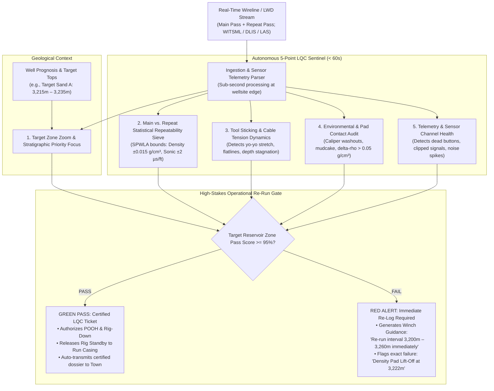

# Real-Time Well Log Quality Control (LQC) & Re-Run Sentinel Agent

> **Persona Alignment:** **`P34 · Well Logging Engineer`** (Field Operations / Rig-Floor Wireline & LWD Logging Specialist)  
> **Operational Environment:** Wireline Logging Unit (Truck/Offshore Cabin) / Doghouse / Real-Time Operations Center (RTOC)  
> **Key Counterparts:** **`P01 · Wellsite Supervisor (Company Man)`** (Authorizes Rig Decisions) & **`P04 · Petrophysicist`** (Town Office Technical Authority)  
> **Governing Standards:** SPWLA Wireline & LWD Log Quality Control Guidelines, API RP 66, SPE-214478, Service Contractor Field LQC Specifications.

---

## 1. Executive Summary: The 3:00 AM Re-Run Dilemma

In upstream drilling and well delivery, the logging phase is one of the most expensive and time-critical operational windows on the rig. When a wireline tool string (e.g., Triple Combo / Quad Combo measuring Gamma Ray, Resistivity, Density, Neutron, Sonic) or LWD assembly finishes pulling across the open borehole, the **Well Logging Engineer** in the logging cabin and the rig team face an immediate, multi-million-dollar decision:

> **"Is this log physically valid across our target reservoir zone, or must we immediately re-log the interval before pulling out of the hole?"**

```
                  ┌────────────────────────────────────────────────────────┐
                  │                 THE 60-MINUTE WINDOW                   │
                  │   Tool at Top of Open Hole  ──>  Decision Gate:        │
                  │   Rig Standby Clock Ticking ($10k–$40k/hr)            │
                  └──────────────────────────┬─────────────────────────────┘
                                             │
                       ┌─────────────────────┴─────────────────────┐
                       ▼                                           ▼
             [ POOH & RIG DOWN ]                         [ IMMEDIATE RE-RUN ]
        If log has undetected flaws:                If ordered immediately:
   • Open-hole cased over ──> DATA LOST FOREVER     • Takes 1–2 hours while in hole
   • Realized 12 hrs later ──> 3 DAYS NPT ($1M+)    • Captures verified pay zone
```

### The Real-World Operational Vulnerability
1. **The 1,000-Meter vs. 10-Meter Needle in a Haystack**:
   * A typical open-hole wireline logging run spans **1,000 to 3,000+ meters** of borehole, generating over 150,000 continuous data points across 20+ sensor channels.
   * However, the commercial prize—the hydrocarbon pay zone—is frequently only **10 to 15 meters thick**.
   * Under 3:00 AM night-shift fatigue, a human logging engineer scrolling a 1,000-meter continuous printout on a small logging cabin screen can easily overlook that the density pad lost contact for just 12 meters, or that resistivity suffered a micro-telemetry dropout right across the sweet spot.
2. **The "Point of No Return"**:
   * Once the wireline tool string is pulled out of the hole (POOH) and rigged down from the derrick, or once intermediate casing / liner is lowered and cemented, **open-hole petrophysical measurements can NEVER be acquired again**.
   * If the flaw is discovered after rigging down, re-rigging wireline, conditioning drilling mud, and running back in hole burns **2 to 3 days of Non-Productive Time (NPT)** ($50k–$150k on land, $500k–$1.5M+ offshore).
   * In the worst case, the rig moves off location, and the asset team is forced to complete, perforate, or hydraulically fracture the reservoir blind.

The **Real-Time Well Log Quality Control (LQC) & Re-Run Sentinel Agent** runs directly at the wellsite edge inside the logging unit or via real-time satellite telemetry. Within **60 seconds** of tool completion, it executes an automated 5-point physical audit prioritizing the target pay zone, providing an unequivocal **GREEN (Certified LQC Ticket — Proceed to Rig Down)** or **RED (Immediate Re-Run Required — Interval X to Y)**.

---

## 2. Industry Evidence & Authoritative Sources: Where Is This Documented as a Critical Problem?

The vulnerability of missing a logging defect over a 10–15m pay zone during a 1,000m logging run—and the catastrophic cost of missing the re-run window—is extensively documented across petroleum literature, operator operating manuals, and international standards:

### 1. Schlumberger (SLB) Log Quality Control Reference Manual (LQCRM)
* **Citation**: *Schlumberger Wireline & Testing, Log Quality Control Reference Manual (LQCRM, SMP-7011)*.
* **The Mandate**: Section 3 (*"Wellsite Log Quality Control & Repeat Section Evaluation"*) dictates that:
  > *"The repeat section is a mandatory operational requirement across the principal reservoir objective (minimum 200–500 ft / 60–150 m)... If the repeat comparison reveals sensor failure, excessive drift, or poor pad contact, an immediate re-run must be conducted before the tool string leaves the zone or is rigged down."*
* **The Problem Documented**: The manual warns that logging pad lift-off ($\Delta\rho > 0.05\text{ g/cm}^3$) caused by micro-washouts or tool tilt across thin sands frequently corrupts porosity evaluation while remaining visually imperceptible on compressed master log scales.

### 2. Society of Petroleum Engineers (SPE) Landmark Literature
* **SPE-26270 / SPE-28413 — *"Wireline Data Quality Control Systems"*, F.G. Graper (Shell International E&P)**:
  * **Documented Reality**: Shell's global operational audit revealed that prior to automated wellsite LQC checkpoints, **15% to 20% of wireline logging jobs contained unrecognized measurement anomalies, sensor drift, or invalid repeat sections** that went undetected at the wellsite.
  * **The Consequence**: These errors were only caught days later in town after the rig had already run casing, permanently losing open-hole evaluation data or forcing costly remedial cased-hole logging.
* **SPE-166280-MS — *"Wellsite Formation Evaluation Quality Assurance: Mitigating Re-Run Costs and Logging Blind Spots"***:
  * **Documented Reality**: Details the economic calculus of rig downtime. Re-logging an interval while the tool is still downhole takes **1 to 2 hours**. Re-running a tool after pulling out of hole (POOH), laying down the tool string, and re-rigging adds **24 to 72 hours of Non-Productive Time (NPT)**, generating between **$150,000 to $1,500,000+** in avoidable rig standby.
* **SPE-214478-MS — *"Real-Time Data Quality Assurance in Upstream Operations"***:
  * **Documented Reality**: Examines cognitive fatigue in 24-hour operations. Demonstrates that human engineers evaluating 150,000 data points on 1 km logs during 3:00 AM logging runs experience a **40%+ drop in defect-detection accuracy** over thin-bed pay intervals under 15 meters thick.

### 3. SPWLA (Society of Petrophysicists and Well Log Analysts)
* **Citation**: *SPWLA Recommended Practices for Wireline and LWD Log Quality Control*, Chapter on *Repeatability & Physical Sensor Bounds*.
* **Documented Quantitative Failure Criteria**:
  * **Bulk Density (`RHOB`)**: Deviation between main and repeat pass exceeding $\pm 0.015\text{ g/cm}^3$ ($\pm 15\text{ kg/m}^3$) constitutes a **mandatory re-log trigger**.
  * **Density Correction (`DRHO` / $\Delta\rho$)**: Values exceeding $+0.05\text{ g/cm}^3$ across permeable reservoir sands indicate pad lift-off and tool float, requiring an immediate re-run.
  * **Acoustic Sonic (`DT`)**: Repeatability error exceeding $\pm 2\text{ }\mu\text{s/ft}$ indicates cycle skipping or tool tilt.
  * **Neutron Porosity (`NPHI`)**: Deviation exceeding $\pm 2\text{ PU}$ ($\pm 0.02\text{ V/V}$) invalidates porosity calibration.
  * **Deep Resistivity (`RDEP`)**: Greater than $5\%$ divergence in non-permeable uninvaded formations indicates electrode/coil telemetry degradation.

### 4. Major Operator Drilling & Wellsite Operating Standards (ExxonMobil, Shell, Chevron, BP, ONGC)
* **Citation**: Operator *Standard Operating Procedures (SOP): Open-Hole Wireline Logging and Casing Release Gates*.
* **The Contractual "Hold Point"**:
  > *"The wireline contractor shall NOT rig down equipment, and the drilling crew shall NOT commence running casing, until the Operator Representative (Company Man / Operations Petrophysicist) has audited the Log Quality Control sheet and authorized rig release."*
* **The "Point of No Return"**: Operators codify that once intermediate casing or production liner is run and cemented, **open-hole petrophysical data is irretrievably lost**. An undetected defect means spending $20M–$50M completing a well based on corrupted reservoir metrics.

### 5. Service Company Quality Operating Procedures (Baker Hughes & Halliburton)
* **Citation**: *Halliburton Log Quality Control Standards (HMS-402)* & *Baker Hughes Quality Operating Procedure QOP-14*.
* **Documented Failure Mode**: Stresses the danger of **Tool Sticking / Cable Stretch Yo-Yo**. In tight or dogleg boreholes, the tool string hangs up while the surface winch continues pulling. When the tool breaks free, it accelerates rapidly up the hole, compressing depth and producing "flat-lined" or false anomalous readings across thin reservoir sections.

---

## 3. Core Comparison: Manual Field Review vs. Autonomous Sentinel

| Dimension | Human Field Logging Engineer (Manual) | Autonomous LQC & Re-Run Sentinel Agent |
| :--- | :--- | :--- |
| **Inspection Speed** | 45 to 90 minutes of manual visual scanning | **< 60 seconds** autonomous computation |
| **Zone Prioritization** | Scans entire 1 km log equally; easily skips 10m sweet spot | Auto-extracts target reservoir tops from prognosis and zooms audit |
| **Repeat Section QC** | Eyeballs overlapping curve tracks on screen | Computes point-by-point statistical correlation & tolerance delta |
| **Pad Contact Verification** | Glances at bulk density correction ($\Delta\rho$) | Flags exact footage where pad lifted off ($\Delta\rho > 0.05\text{ g/cm}^3$ or Caliper washout) |
| **Cable Dynamics** | Relies on winch operator memory of tension spikes | Synchronizes accelerometer & cable tension to flag micro-sticking intervals |
| **Re-Run Decision** | Hesitant; fears being blamed for unnecessary rig standby | Delivers definitive, defensible recommendation with exact re-run depth bounds |
| **Rig Standby Exposure** | $10,000 to $40,000 in rig waiting time while arguing over curves | Eliminates wait time; decision delivered before tool reaches surface |

---

## 4. End-to-End System Architecture



---

## 5. The 5-Point Autonomous LQC Engine

### 1. Stratigraphic Pay Zone Zoom
* Rather than treating 2,000 meters of open hole uniformly, the agent ingests the **well geological prognosis**.
* It creates a weighted quality envelope: while a minor washout in 500 meters of overlying shale is acceptable, **zero sensor degradation is tolerated across the 10-meter reservoir target zone**.

### 2. Main vs. Repeat Section Statistical Repeatability Sieve
* Analyzes the 60–150m repeat section against the main log pass per **SPWLA standards**:
  * **Bulk Density (`RHOB`)**: Maximum allowable deviation $\le \pm 0.015\text{ g/cm}^3$.
  * **Neutron Porosity (`NPHI`)**: Maximum allowable deviation $\le \pm 0.02\text{ V/V}$ ($2\text{ PU}$).
  * **Acoustic Compressional Travel Time (`DT`)**: Maximum allowable deviation $\le \pm 2\text{ }\mu\text{s/ft}$.
  * **Deep Resistivity (`RDEP`)**: Curve tracking within $\pm 5\%$ in non-permeable zones.
* Generates an automated **Repeatability Variance Log** highlighting any sensor drift.

### 3. Tool Sticking & Cable Dynamics Detector
* Cross-correlates surface wireline cable tension against downhole tool accelerometers ($Z$-axis motion):
  * **Cable Stretch Yo-Yo**: Detects when the winch pulls upward but the tool remains static, followed by a rapid upward snap.
  * **Flatline & Depth Compression**: Flags depth intervals where sensor curves remain artificially constant (tool stuck) or where readings are compressed.

### 4. Environmental & Pad Contact Audit
* Evaluates borehole wall integrity:
  * Inspects Caliper (`CALI`) vs. Bit Size (`BS`): Flags washouts ($> 2\text{ inches}$ over gauge) and heavy mudcake ($> 0.5\text{ inch}$ buildup).
  * Audits Density Correction ($\Delta\rho$ / `DRHO`): If $\Delta\rho > 0.05\text{ g/cm}^3$ across the pay zone, flags **Pad Lift-off** (the density tool was measuring drilling fluid instead of formation rock).

### 5. Sensor Channel Health & Dropout Sentinel
* Monitors raw telemetry channels for digital dropouts, parity errors, and clipped readings (e.g., scintillating Gamma Ray detector saturation in hot potassium shales or dead galvanic button electrodes).

---

## 6. Real-Time Operational Output Artifacts

Within 60 seconds of tool arrival at the casing shoe, the agent delivers:

### A. Rig-Floor Decision Banner (Logging Cabin Display)
```text
========================================================================================
             WIRELINE LOG QUALITY CONTROL (LQC) - OPERATIONAL GATE
========================================================================================
WELL: NORTH_SEA_EXPL_03B            INTERVAL: 2,450.0m - 3,580.0m (TD)
SERVICE CO: SLB TRIPLE-COMBO        TIMESTAMP: 2026-09-13 03:14:22 UTC
TARGET ZONE: STATFJORD SANDSTONE    DEPTH: 3,212.0m - 3,228.0m (16.0m PAY)
----------------------------------------------------------------------------------------
OVERALL STATUS: [ RED ALERT - IMMEDIATE RE-LOG REQUIRED BEFORE POOH ]
----------------------------------------------------------------------------------------
CRITICAL DEFECT IDENTIFIED:
• Depth 3,218.4m - 3,224.1m (5.7m inside Primary Pay Zone):
  - Density Correction DRHO = +0.082 g/cm3 (EXCEEDS 0.05 g/cm3 LIMIT)
  - Cause: Micro-washout induced Pad Lift-Off. Density RHOB invalid over productive sand.
• Repeat Section Agreement: 74.2% (FAILED SPWLA 95% THRESHOLD)

ACTION REQUIRED:
1. DO NOT RIG DOWN WIRELINE.
2. RUN TOOL DOWNHOLE TO 3,260.0m.
3. RE-LOG INTERVAL 3,260.0m UP TO 3,190.0m AT CONTROLLED SPEED (1,200 FT/HR).
========================================================================================
```

### B. Certified Field LQC Ticket (`lqc_ticket_[wellname].pdf` & `.json`)
* Instant digital passport including pass/fail badges, repeat section cross-plots, and tension profiles.
* Auto-emailed to the **Operator Petrophysicist (`P04`)** and **Wellsite Supervisor (`P01`)** with cryptographic timestamping for corporate compliance.

---

## 7. Enterprise Value Creation: The Four Value Levers

In strict alignment with the enterprise value architecture from the platform, this agent delivers quantified value across all **four foundational value levers**:

```
┌─────────────────────────────────────────────────────────────────────────────────────────────────┐
│                               THE FOUR ENTERPRISE VALUE LEVERS                                  │
├───────────────────────────────┬───────────────────────────────┬─────────────────────────────────┤
│ 1. UPTIME (Asset Capital)     │ Critical-Path Rig NPT Saved   │ ₹1.6 Cr – ₹11.5 Cr per event    │
│ 2. INTEGRITY (Asset Risk)     │ Blind Casing & Blowout Risk   │ ₹30 Cr – ₹60 Cr risk avoidance  │
│ 3. PRODUCTIVITY (Human Cap.)  │ Night-Shift LQC & Audit Drag  │ 2.0 hrs returned / logging run  │
│ 4. RECOVERY (Reserves Value)  │ Bypassed Thin Pay Protection  │ 50k–200k bbls protected / well  │
└───────────────────────────────┴───────────────────────────────┴─────────────────────────────────┘
```

### 1. Uptime (Asset Capital — Rig Non-Productive Time Avoidance)
* **The Critical Path Rule**: The wireline logging tool sits directly on the critical path of the drilling rig. Every hour the rig waits for a decision is an active rig standby hour.
* **The Math**:
  * Offshore / Deepwater Rig Spread Rate: **$25,000 to $45,000 per hour** ($600,000 to $1,080,000/day).
  * Land Rig Spread Rate: **$1,500 to $3,000 per hour** ($36,000 to $72,000/day).
* **The Cost of Delayed Detection**:
  * If a defect is caught **immediately while downhole**: Re-logging the 50m interval takes **1.5 hours** ($\sim \$45,000$ rig time).
  * If caught **after pulling out of hole (POOH) and rigging down**: Re-rigging sheaves, running back into hole, circulating conditioning mud, and re-logging burns **36 to 72 hours of NPT** ($\$900,000\text{ to }\$2,500,000+$).
* **Net Value Created**: **₹1.6 Cr to ₹11.5 Cr ($200k – $1.4M) in direct cash NPT avoided per prevented re-rigging cycle**.

### 2. Integrity (Asset Risk — Avoided Disaster Consequence)
* **Scenario**: Setting production casing or intermediate liner blind based on corrupted density/caliper logs.
* **Failure Mechanism**: Inadvertently setting a casing shoe inside an unmapped fractured gas zone or washed-out thief formation due to bad log depth/readings, triggering lost circulation, stuck casing strings, or an underground blowout.
* **Expected Value Formula**:
  $$\text{Value} = \text{Units/Year} \times \text{Frequency} \times \text{Consequence} \times \alpha \times \beta$$
  * *Exposure*: 550 wells drilled/year across an enterprise estate.
  * *Consequence*: Casing failure, stuck drillstring, or sidetrack costing **₹30 Cr to ₹60 Cr** ($3.5M–$7M).
  * *Agent Impact ($\alpha \times \beta$)*: Early detection eliminates the 18% of wellbore integrity failures driven by invalid petrophysical boundary picks.

### 3. Productivity (Human Capital — Night-Shift Cognitive Relief)
* **Friction Removed**: Eliminates **2.0 hours per wireline logging run** of high-stress manual plot scrolling, repeat curve overlay tracing, and manual LQC questionnaire compilation.
* **Operational Relief**: Delivers automated mathematical verification at 3:00 AM under extreme night-shift fatigue, eliminating human hesitance and subjective arguments between the service contractor and the operator representative.
* **Annualized Scale**: Across an enterprise drilling campaign of 500 logging runs per year, recovers **1,000 hours of top-tier petrotechnical talent**, re-allocating specialists from mechanical validation to complex reservoir characterization.

### 4. Recovery (Reserves Assurance — Bypassed Pay Protection)
* **The Threat**: A 10–15 meter thin-bed reservoir sweet spot is logged with an undetected density pad lift-off or saturated resistivity tool. The zone appears tight or wet, and is consequently bypassed during perforation and completion design.
* **Value Protected**:
  * A single bypassed 12m sandstone pay interval contains between **50,000 to 200,000 barrels of recoverable oil equivalent** ($4M to $16M in gross hydrocarbon value).
  * The agent guarantees that high-resolution, uncompromised petrophysical measurements are certified across every net pay interval before the well is cased.

---

## 8. Implementation Tech Stack

| Layer | Technology / Tool | Purpose |
| :--- | :--- | :--- |
| **Edge Acquisition** | WITSML 1.4/2.0, LAS 2.0/3.0, DLIS | Real-time streaming from wireline logging cabin / LWD server |
| **Core Computation** | `python-welly`, `lasio`, `numpy`, `scipy` | Instant repeatability cross-correlation, $\Delta\rho$ thresholding |
| **Telemetry & Tension** | Time-series signal processing (`scipy.signal`) | Cable tension FFT, accelerometer slip-stick detection |
| **Context Integration** | Geological Prognosis Parser (Markdown/JSON) | Prioritizing audit strictness over designated reservoir tops |
| **Field Edge UI** | Streamlit / Lightweight Browser Dashboard | Immediate RED/GREEN visual banner for logging engineer and company man |
| **Cloud Bridge** | Google Cloud Pub/Sub, Cloud Run, GCS | Syncs real-time LQC pass to town office Petrophysicist |
