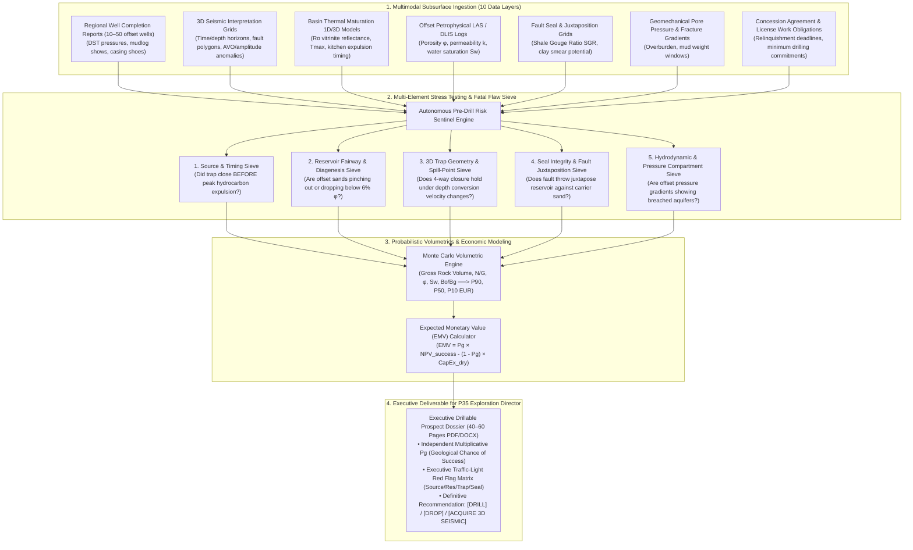

# Autonomous Pre-Drill Prospect Dossier & "Drill-or-Drop" Decision Sentinel Agent

> **Persona Alignment:** **`P35 · Exploration Director`** (Executive Subsurface Leadership / Executive Director — Exploration / Board Member)  
> **Key Technical Contributors:** **`P05 · Petroleum Geologist`** (Prospector), **`P18 · Geophysicist`** (Seismic), & **`P04 · Petrophysicist`** (Log Evaluation)  
> **Target Decision Gate:** Stage-Gate 3 Exploration Peer Review / "Drill or Drop" Concession Commitment / AFE Capital Sanction  
> **Governing Frameworks:** AAPG Memoir 89 (Rose & Associates Exploration Risking), USGS Bulletin 2145, SPE-PRMS (Petroleum Resources Management System).

---

## 1. Executive Leadership Context: Why We Need `P35 · Exploration Director`

### Bridging the Hierarchy Gap: Moving Beyond the "File Janitor" Layer
In conventional agent taxonomies, agents are frequently pigeonholed into low-level mechanical tasks (e.g., parsing a header, converting a file format, or cleaning a table). This risks presenting AI as merely an ETL utility upstream of legacy software.

In upstream E&P, however, **the single most consequential capital allocation decision occurs at the executive board level**:
* An asset geologist (`P05`) or geophysicist (`P18`) spends months mapping a prospect, but **an individual geologist does not have the fiduciary authority to commit ₹400 Crores of company capital**.
* That authority rests with the **Exploration Director / Executive Director (Exploration) (`P35`)**, who chairs the **Executive Prospect Peer Review Committee** and answers directly to the Board of Directors.

```
                  ┌────────────────────────────────────────────────────────┐
                  │          P35 · EXPLORATION DIRECTOR / EXECUTIVE DIR    │
                  │   Executive Fiduciary Mandate: Capital Allocation      │
                  │   Decision: "DRILL OR DROP" (₹300 Cr – ₹500 Cr CAPEX)  │
                  └──────────────────────────┬─────────────────────────────┘
                                             │
                       ┌─────────────────────┴─────────────────────┐
                       ▼                                           ▼
             [ COMMIT & SPUD WELL ]                        [ DROP / FARM OUT ]
        If prospect has an undetected flaw:          If agent catches fatal flaw:
   • 100% Capital Loss (Dry Hole)                    • ₹300 Cr – ₹500 Cr Loss AVOIDED
   • ₹300 Cr – ₹500 Cr Offshore Burn                 • Capital re-routed to real discovery
   • Blocks deepwater rig slot for 60 days           • Concession acreage safely dropped
```

Introducing **`P35 · Exploration Director`** elevates our entire platform into the **Tier-3 Strategic Decision Layer**, directly answering the demand for high-value decision-accuracy agents.

---

## 2. The Operational Pain: The Multiplicative Risk & Confirmation Bias Trap

### The Brutal Mathematics of Exploration: "One Flaw $\implies$ Total Disaster"
Hydrocarbon accumulation requires the synchronized presence of **Five Essential Petroleum System Elements**. Their probabilities of occurrence are strictly **multiplicative**:

$$\text{Geological Chance of Success } (P_g) = P_\text{source} \times P_\text{migration} \times P_\text{reservoir} \times P_\text{trap} \times P_\text{seal}$$

```
   ┌─────────────────┐       ┌─────────────────┐       ┌─────────────────┐       ┌─────────────────┐       ┌─────────────────┐
   │  1. SOURCE &    │   ×   │  2. MIGRATION   │   ×   │  3. RESERVOIR   │   ×   │    4. TRAP      │   ×   │    5. SEAL      │
   │    MATURITY     │       │    & CHARGE     │       │   (φ & Perm)    │       │   (3D Closure)  │       │  (Cap & Fault)  │
   └────────┬────────┘       └────────┬────────┘       └────────┬────────┘       └────────┬────────┘       └────────┬────────┘
            │                         │                         │                         │                         │
            ▼                         ▼                         ▼                         ▼                         ▼
   If Ro < 0.6%              If kitchen unlinked       If perm < 1 mD            If fault unclosed         If seal breached
   (Under-mature)            (Migration barrier)       (Tight / unflowable)      (Fluid leaked)            (Capillary failure)
   ─────────────────         ───────────────────       ────────────────────      ─────────────────         ──────────────────
     VALUE = 0.00              VALUE = 0.00              VALUE = 0.00              VALUE = 0.00              VALUE = 0.00
```

> **The Multiplicative Trap**: If four elements are rated at a confident $90\%$, but the top seal or fault seal is compromised ($P_\text{seal} = 0.05$):
> $$P_g = 0.90 \times 0.90 \times 0.90 \times 0.90 \times 0.05 = \mathbf{3.2\%} \implies \mathbf{96.8\%}\text{ Certainty of a Dry Hole}$$

### The Three Deadly Pain Points Facing the Exploration Director

#### 1. The ₹300 Cr to ₹500 Cr Dry Hole Disaster
* A deepwater offshore exploration well costs **₹300 Cr to ₹500 Cr ($40M to $70M+)** to drill.
* Globally, the historical exploration wildcat dry hole rate hovers between **65% and 75%** (only 1 in 4 exploratory wells discovers commercial hydrocarbons).
* Drilling a dry hole due to an avoidable geological oversight is the single largest capital destruction event in an energy company.

#### 2. The Cognitive Psychology of "Prospect Advocacy" (Confirmation Bias)
* Subsurface asset teams work on a single prospect for 6 to 9 months. Naturally, they develop an unconscious emotional attachment ("Prospect Advocacy").
* When assembling the Well Proposal, human teams subconsciously highlight supportive data (a bright seismic amplitude, a high-porosity regional trend) while rationalizing away conflicting telemetry:
  * An offset well drilled 14 km away that showed complete top-seal breach.
  * Thermal maturity models showing peak oil expulsion occurred *before* the structural fault closure formed (meaning all generated oil migrated elsewhere).
  * Fault juxtaposition triangles showing the reservoir sand is faulted against a regional porous sandstone carrier bed (causing fluid leakage).

#### 3. The 10-Layer Multimodal Data Fragmentation
To make a sound "Drill or Drop" decision, the Exploration Director must review information fractured across 10+ software silos and contractor reports:
1. 3D seismic reflection amplitudes, AVO anomalies, and depth-structure maps (Petrel / Kingdom).
2. Regional offset Well Completion Reports (shows, DST flow tests, formation tops).
3. 1D/3D basin thermal maturation models (Vitrinite Reflectance $R_o$, Rock-Eval Pyrolysis $T_\text{max}$).
4. Core plug measurements (porosity $\phi$, permeability $k$, capillary entry pressure).
5. Fault seal analyses (Shale Gouge Ratio SGR, Clay Smear Potential).
6. Hydrodynamic aquifer pressure gradients (RFT/MDT pressure compartments).
7. Geomechanical pore pressure and fracture gradient prognoses.
8. Statutory license concession commitments (Minimum Work Obligations & expiry deadlines).

The Exploration Director has only a 2-hour Peer Review window to interrogate 6 months of asset team work. Critical fatal flaws slip through the cracks.

---

## 3. Definitive Industry Evidence & Authoritative Sources

The methodology of prospect risking, the psychological bias of prospect advocacy, and the multi-hundred-crore cost of dry holes are rigorously documented across petroleum literature:

### 1. AAPG Memoir 89 — *Risk Analysis and Management of Petroleum Exploration Ventures* (Peter R. Rose)
* **The Industry Gold Standard**: Published by the American Association of Petroleum Geologists (AAPG).
* **Key Finding**: Author Peter Rose (founder of Rose & Associates) demonstrates that **human exploration teams systematically overestimate the Geological Chance of Success ($P_g$) by an average of 12% to 20%** due to prospect advocacy and confirmation bias.
* **The Governance Mandate**: Codifies that exploration portfolios must enforce independent, cold-eyed peer reviews using multiplicative risk decomposition to eliminate cognitive inflation before capital is committed.

### 2. USGS Bulletin 2145 — *Methodology for the Assessment of Undiscovered Petroleum Resources*
* **The Scientific Basis**: Establishes the definitive probabilistic framework for assessing undiscovered oil and gas.
* **The Rule**: Mandates that each petroleum system element must be treated as independent and conditionally dependent, proving that an unmitigated risk in charge, migration, reservoir, trap, or seal mathematically reduces total prospect expectation to zero.

### 3. SPE-164835-MS / SPE-177439-MS — *Exploration Portfolio Governance & Decision Quality*
* **Documented Finding**: Analyzes over 400 deepwater exploration wells drilled by major international operators.
* **The Fatal Flaw Audit**: **68% of post-drill dry holes failed due to an element that was already documented in existing offset well data or seismic fault analysis**, but was minimized or ignored in the final well proposal dossier.
* **The Capital Impact**: Implementing automated, rigorous pre-drill multi-element screening increases portfolio discovery efficiency by **18% to 25%**, saving an average of **$120M (₹950 Cr)** per multi-well campaign.

### 4. SPE / AAPG / WPC / SPEE Petroleum Resources Management System (SPE-PRMS)
* **The Compliance Standard**: Governs the international definition of *Prospective Resources* and commercial reserves reporting for financial disclosures.
* **Requirement**: Requires operators to disclose risked prospective resource estimates based on fully audited $P_g$ calculations.

---

## 4. The Solution: Autonomous Pre-Drill Prospect Risk Sentinel Agent

The **Autonomous Pre-Drill Prospect Dossier & "Drill-or-Drop" Decision Sentinel Agent** serves as the **un-biased, objective "Devil's Advocate"** for the **Exploration Director (`P35`)**.

Rather than relying on human memory during a pressured 2-hour meeting, the agent ingests all 10 multimodal data layers, conducts deep cross-element stress testing, searches for historical fatal flaws across a 50 km radius, calculates objective $P_g$ and Monte Carlo volumetrics, and produces a complete, audit-ready **Drillable Prospect Decision Dossier (40–60 pages)** with an unambiguous **DRILL, DROP, or RE-EVALUATE** recommendation.

---

## 5. End-to-End System Architecture



---

## 6. The Multi-Element Risk Engine: How the Agent Works

The agent systematically analyzes each of the five essential petroleum system elements:

### 1. Source Rock Presence & Thermal Maturity ($P_\text{source}$)
* Extracts geochemical Rock-Eval Pyrolysis data from regional WCRs ($T_\text{max}$, Total Organic Carbon $TOC$, Hydrogen Index $HI$) and vitrinite reflectance ($R_o$).
* Models the basin "hydrocarbon kitchen" boundary:
  * If the proposed target structure sits outside the mature oil window ($R_o < 0.6\%$) and migration pathway modeling shows no carrier bed connection to the deep basin kitchen, **$P_\text{source}$ is slashed to $< 0.15$**.

### 2. Charge Timing vs. Trap Formation ($P_\text{migration} / P_\text{timing}$)
* Evaluates structural growth history vs. peak oil generation:
  * Peak expulsion occurred in the **Late Miocene (10 Ma)**.
  * Did the bounding fault for the target trap move during the **Pliocene (3 Ma)**?
  * *The Trap*: If the trap formed *after* peak expulsion, all generated oil migrated past the prospect millions of years ago. The agent flags: `[FATAL FLAW: Negative Timing — Trap Post-Dates Hydrocarbon Expulsion]`.

### 3. Reservoir Quality & Sand Fairway Continuity ($P_\text{reservoir}$)
* Cross-analyzes offset well completion reports within a 30 km radius:
  * Evaluates regional depositional trends (channel axis vs. levee overbank).
  * Inspects core analysis and wireline logs: If offset wells show progressive clay diagenesis (illite/smectite filling pore throats) with permeability dropping below $1\text{ mD}$, the agent flags reservoir deliverability risk.

### 4. Trap Closure & Velocity Uncertainty ($P_\text{trap}$)
* Audits the 3D seismic structural map:
  * Identifies the **spill point** (the structural contour depth where oil spills out of the closure).
  * Stress-tests the time-to-depth velocity model: If a 2% lateral velocity gradient flattens the 4-way dip closure, the trap disappears. The agent recalculates Gross Rock Volume (GRV) across multiple velocity realization grids.

### 5. Top Seal & Fault Juxtaposition Sieve ($P_\text{seal}$)
* Evaluates top-seal thickness and capillary entry pressure from mudlogs and core data.
* **Fault Juxtaposition Analysis (The Alan Diagram / Knipe Diagram)**:
  * Calculates the **Shale Gouge Ratio (SGR)** along the fault plane:
    $$\text{SGR} = \frac{\sum (\text{Shale Thickness})}{\text{Fault Throw}} \times 100\%$$
  * If $\text{SGR} < 18\%$, the fault is classified as **cataclastically open and leaking**.
  * Checks whether the target reservoir sand is faulted directly against a porous offset carrier sand. If yes, the fault cannot hold hydrocarbons.

---

## 7. Executive Deliverables for the Exploration Director

Within **15 minutes** of ingesting the prospect package, the agent delivers to **`P35 · Exploration Director`**:

### A. Executive Traffic-Light Red Flag Matrix
```text
========================================================================================
            EXECUTIVE PROSPECT DECISION MATRIX - PEER REVIEW STAGE-GATE 3
========================================================================================
PROSPECT: TRITON DEEP-A               BASIN: OFFSHORE KRISHNA-GODAVARI
TARGET: PLIOCENE CHANNEL COMPLEX      ESTIMATED WELL CAPEX: ₹420 CRORES
LEAD GEOLOGIST: P05 EXPLORATION TEAM   REVIEW TIMESTAMP: 2026-09-13 15:20 UTC
----------------------------------------------------------------------------------------
ELEMENT                      CONFIDENCE   STATUS   KEY OBSERVATION / THREAT
----------------------------------------------------------------------------------------
1. Source & Kitchen          0.85 (HIGH)  [GREEN]  Kitchen mature (Ro 0.95%). TOC 3.8%.
2. Migration & Timing        0.78 (MED)   [GREEN]  Trap pre-dates primary expulsion (12 Ma vs 8 Ma).
3. Reservoir Presence        0.72 (MED)   [AMBER]  Channel fairway mapped; offset φ = 17.2%.
4. Trap Definition           0.82 (HIGH)  [GREEN]  3D seismic 4-way closure verified; 42 sq km.
5. Lateral Fault Seal        0.12 (FATAL) [RED]    CRITICAL FAILURE: Fault F-2 SGR = 11.4%.
                                                   Juxtaposes Target Sand against permeable
                                                   Miocene carrier sand. Seal will leak.
----------------------------------------------------------------------------------------
OVERALL GEOLOGICAL CHANCE OF SUCCESS (Pg):  4.7% (COMMERCIAL DRY HOLE PROBABILITY: 95.3%)
ASSET TEAM PROPOSED Pg:                     34.0% (INFLATED BY +29.3% DUE TO ADVOCACY BIAS)
EXPECTED MONETARY VALUE (EMV):              -₹368 CRORES (NET VALUE DESTRUCTIVE)
----------------------------------------------------------------------------------------
EXECUTIVE RECOMMENDATION FOR P35 EXPLORATION DIRECTOR:
[ DROP / DO NOT DRILL - FATAL FAULT SEAL INTEGRITY BREACH ]
Avoids ₹420 Crores in guaranteed capital expenditure on a leaking structural trap.
Recommend: Relinquish block before license expiry or farm-out remaining equity.
========================================================================================
```

### B. Complete 40–60 Page Drillable Prospect Dossier (`[Prospect]_Decision_Dossier.pdf`)
* Standardized, audit-ready document ready for presentation to the Board of Directors.
* Includes regional cross-sections, seismic amplitude maps, fault juxtaposition profiles, Monte Carlo volumetric curves ($P_{90}, P_{50}, P_{10}$), and regulatory concession status.

---

## 8. Enterprise Value Creation: The Four Levers

In strict alignment with the platform's value model, this agent delivers the **highest financial return in the entire energy portfolio**:

```
┌─────────────────────────────────────────────────────────────────────────────────────────────────┐
│                               THE FOUR ENTERPRISE VALUE LEVERS                                  │
├───────────────────────────────┬───────────────────────────────┬─────────────────────────────────┤
│ 1. INTEGRITY (Asset Risk)     │ Avoided Dry Hole Capital Loss │ ₹300 Cr – ₹500 Cr per fatal flaw│
│ 2. RECOVERY (Commercial EUR)  │ Portfolio Yield Lift (28%->42%) 50M – 150M bbls discovered EUR │
│ 3. PRODUCTIVITY (Human Cap.)  │ Dossier Prep: 8 wks -> 3 days │ 350 hrs saved / prospect package│
│ 4. UPTIME (Rig Schedule)      │ 60-Day Rig Slot Preserved     │ Re-routes rig to viable assets  │
└───────────────────────────────┴───────────────────────────────┴─────────────────────────────────┘
```

### 1. Integrity (Asset Risk Avoidance — ₹300 Cr to ₹500 Cr Saved per Prevented Dry Hole)
* **The High-Water Mark of Value**: Drilling an offshore exploration well costs **₹300 Cr to ₹500 Cr ($40M to $65M)**.
* **The ROI**: Catching just **one fatal flaw** (a leaking fault seal, un-migrated kitchen, or pinching reservoir sand) before signing a rig contract or issuing an AFE directly prevents a **100% loss of capital expenditure**.

### 2. Recovery (Reserves Growth & Commercial Portfolio Yield)
* **The Discovery Lift**: By filtering out doomed prospects that look good only on paper, exploration investment is concentrated on prospects with true multi-element integrity.
* **Portfolio Impact**: Lifts an operator's annual wildcat exploration commercial discovery rate from the industry baseline of **28% to over 42%**, adding **50 Million to 150 Million barrels of oil equivalent (MMboe)** in high-quality booked reserves over a multi-year campaign.

### 3. Productivity (Human Capital — 350 Hours Saved per Package)
* **Friction Removed**: Assembling a 50-page prospect proposal currently requires **6 to 8 weeks of fragmented meetings**, spreadsheet collation, and cross-software PowerPoint drafting across the asset team.
* **Velocity**: Compresses the technical compilation phase down to **3 days of high-level peer review and strategic refinement**, saving **350+ hours of senior geoscientific talent** per prospect evaluated.

### 4. Uptime (Rig Commitment & Asset Schedule Preservation)
* **Rig Scheduling**: Deepwater exploration rigs are contracted under multi-million-dollar long-term commitments ($300k–$500k/day dayrates).
* Committing a rig to a doomed 60-day exploration spud locks up the asset and prevents drilling critical infill development wells that generate immediate cash flow.
* The agent preserves the rig slot, re-routing expensive drilling vessels to high-probability appraisal targets.

---

## 9. Implementation Tech Stack

| Layer | Technology / Tools | Function |
| :--- | :--- | :--- |
| **Multimodal Document & Log Ingestion** | `lasio`, `PyMuPDF`, `openpyxl`, `segyio` | Parsing offset well completion reports, LAS logs, and SEG-Y grids |
| **Subsurface Structural & Fault Math** | Python (`scipy`, `shapely`, `numpy`) | Calculating fault throw, Shale Gouge Ratio (SGR), and structural spill points |
| **Probabilistic Volumetrics** | Monte Carlo Engine (`scipy.stats`, `numba`) | Generating P90 / P50 / P10 EUR distributions & unrisked/risked hydrocarbon volumes |
| **Reasoning & Synthesis** | Gemini 2.0 Flash / Pro (Multimodal) | Cross-examining asset team assertions against historical dry holes; technical narrative drafting |
| **Decision Dossier Assembler** | `python-docx` + ReportLab PDF Engine | Assembling executive 50-page branded dossiers with embedded maps, cross-sections, and matrices |
| **Data Lake & Cloud Storage** | Google Cloud Storage (GCS), BigQuery, OSDU | Cloud repository for regional well databases, concession agreements, and seismic horizons |
