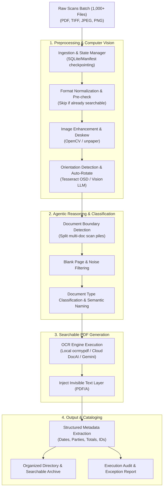

# Intelligent Scanned Document OCR & Transformation Agent

## 1. Executive Summary
Organizations frequently possess thousands of legacy scanned paper documents stored as flat, unsearchable PDFs or image files (JPEG, PNG, TIFF). Traditional conversion utilities merely wrap raw images inside PDF containers without making the content machine-readable, searchable, or organized.

The **Scanned Document OCR & Transformation Agent** is an autonomous, intelligent document pipeline designed to process large batches (e.g., 1,000+ files) of scanned documents. It repairs visual imperfections, performs high-fidelity Optical Character Recognition (OCR), injects an invisible selectable text layer (creating standard PDF/A files), extracts structured metadata, classifies document types, and automatically renames and organizes the archive.

---

## 2. Core Problem Statement: Script vs. Agent

| Dimension | Basic Image-to-PDF Script | Intelligent OCR Agent |
| :--- | :--- | :--- |
| **Orientation & Skew** | Pastes images as-is (often sideways/crooked) | Auto-detects text angle, deskews, and flips upright |
| **Searchability** | Remains a flat, unsearchable image | Injects searchable text layer (`Ctrl+F`, copy-paste, RAG-ready) |
| **Multi-doc Batches** | Combines everything into one dumb file | Detects document boundaries (e.g. splits mixed invoices/contracts) |
| **Naming & Taxonomy** | Retains scanner names (`SCAN_00124.pdf`) | Semantically renames (`2026-03-AcmeCorp-Invoice-9481.pdf`) |
| **Quality Control** | Fails silently on bad or unreadable files | Flags blurs, illegible text, or low-confidence pages for human review |
| **Scale & Idempotency** | Crashes on errors, restarts from scratch | Tracks state via checkpointing manifest, skips processed files |

---

## 3. High-Level Architecture & Workflow

---

## 4. Key Agent Capabilities

### 4.1. Intelligent Pre-Processing
* **Smart Searchability Check**: Fast-scans existing PDFs. If a file already contains high-quality digital text streams, it skips redundant OCR to save computing power and prevent duplicate artifacts.
* **Deskewing & Perspective Rectification**: Detects scan tilt (0.5° to 45°) and straightens pages automatically.
* **Border & Shadow Removal**: Crops dark scanner borders and cleans scanner shadow gradients around margins.
* **Auto-Orientation (OSD)**: Identifies 90°, 180°, and 270° inverted pages and orients them right-side up.

### 4.2. Document Boundary Detection & Splitting
When an operator scans a stack of loose papers in a single feeder pass, the resulting 50-page PDF often contains several distinct documents (e.g., 3 invoices, a 4-page contract, and 2 receipts).
* The agent identifies invoice headers, signature blocks, and page number sequences (`Page 1 of 3`) to split monolithic scan dumps into individual, logical document files.

### 4.3. Dual-Layer Searchable PDF/A Assembly
* Generates an archival-grade **PDF/A** containing the exact original visual image on the top layer and an invisible, perfectly aligned text layer beneath it.
* Ensures 100% fidelity to the original physical record for legal compliance, while enabling instant text selection, search indexing, and downstream LLM/RAG vector search.

### 4.4. Semantic Naming & Metadata Extraction
* Reads headers, dates, vendor names, and reference numbers.
* Converts opaque file names (`SCAN_20260310_0042.pdf`) into standard naming conventions:
  `[YYYY-MM-DD]_[DocumentType]_[Entity]_[ReferenceID].pdf`
  *(e.g., `2026-02-18_Invoice_Chevron_INV-40192.pdf`)*.
* Outputs a companion `catalog.json` or `catalog.csv` containing full metadata fields for all 1,000 files.

---

## 5. Scaling Strategy for 1,000+ PDFs

Processing 1,000 documents requires robust batch engineering:

1. **Multiprocessing / Worker Pool**:
   * Uses Python's `multiprocessing` or asynchronous worker queues to utilize all available CPU cores.
   * On an 8-core / 16-thread machine, OCR throughput can reach ~50–120 pages per minute locally.
2. **Resilience & Checkpoint Manifest**:
   * Maintains a persistent SQLite or JSON manifest (`batch_status.json`) tracking state: `PENDING`, `PROCESSING`, `SUCCESS`, `NEEDS_REVIEW`, `FAILED`.
   * Can be stopped and resumed at any time without reprocessing previously completed files.
3. **Audit & Exception Reporting**:
   * Generates a final summary report upon completion:
     * **Processed**: 984 files
     * **Already Searchable (Skipped)**: 10 files
     * **Flagged for Human Review**: 6 files (e.g., password protected, extreme blur, illegible handwriting)

---

## 6. Recommended Technology Stack

| Layer | Component / Tool | Purpose |
| :--- | :--- | :--- |
| **Batch Engine** | `ocrmypdf` + `Tesseract 5` | Industry standard for generating searchable PDF/A locally at zero API cost. |
| **Image Pre-processing** | `OpenCV`, `Pillow`, `unpaper` | Deskew, binarization, noise removal, auto-cropping. |
| **Document Geometry & PDF** | `PyMuPDF` (`fitz`), `pypdf`, `pdf2image` | Page extraction, boundary splitting, text stream detection. |
| **Reasoning & Vision (LLM)** | Gemini 2.0 Flash / Pro or DocAI | Document boundary segmentation, complex handwriting, semantic naming, metadata extraction. |
| **State & Tracking** | SQLite / Pydantic | Checkpointing, retry loops, and catalog manifest generation. |
| **Interface Options** | CLI / Folder Watcher / Streamlit UI | Drop files into an `input/` folder, CLI monitoring, or web dashboard. |

---

## 7. Implementation Roadmap

### Phase 1: Prototype (MVP)
* Build a local CLI tool using `ocrmypdf` and `PyMuPDF`.
* Add intelligent pre-check (skip already searchable PDFs).
* Add auto-deskew and orientation correction.
* Process a batch of 10–20 test PDFs with status logging.

### Phase 2: Agentic Naming & Metadata
* Integrate Gemini Flash to inspect OCR output and page 1 thumbnail.
* Implement semantic naming and generate `metadata_catalog.csv`.
* Add document boundary detection for multi-doc files.

### Phase 3: Scale & Monitoring (1,000+ Files)
* Implement multi-worker parallel execution and SQLite checkpointing.
* Add blur/legibility confidence scoring and human-in-the-loop review folder (`review_needed/`).
* Package as an automated folder-watcher daemon or interactive Streamlit UI.
