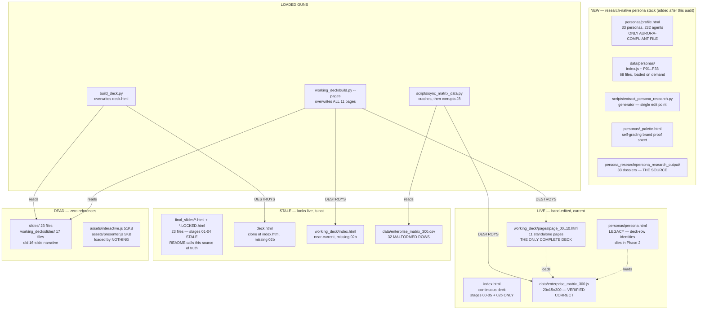

# Code Audit — O&G Agentic Transformation Deck

**Repo:** `O&G_slidedeck_agentic_transformation`
**Commit audited:** `53f1076` ("further simplifies v1")
**Date:** 2026-09-12
**Method:** 4 parallel audits (architecture, data layer, content drift, frontend runtime). Every claim below is machine-verified with a `file:line` citation.

> [!NOTE]
> This file replaces the previous **content / theme / story checklist** (63 open items, baseline `80bd9e4`, scanned 2026-09-11). That checklist covered different ground — number contradictions, light-theme debt, type scale, the missing ask — none of which is re-stated here.
> Recover it at any time with:
> ```
> git show 727ed9e:audit.md > audit_content_2026-09-11.md
> ```
> Two of its items were verified fixed before this overwrite: the `index.html → page_03.html` 404 (now absent) and `slide_10`'s missing `image7.png` (file present, 4.57 MB).

> [!IMPORTANT]
> **Currency check, 2026-09-12 (later the same day).**
> Every **finding** below still stands — none of P0-1…P0-5 or P1-1…P1-7 has been fixed.
> The **architecture picture** in §1 is now out of date: a research-native persona stack was built after this audit ran. See **§10** for what changed, and re-read §1 with that section beside it.
> Colour, typography and brand alignment are **deliberately not covered here** — they are in the companion *Style & Formatting Audit*.

---

## Verdict

> [!IMPORTANT]
> **The content is in better shape than the plumbing.** Your recent de-clutter work (slides 05–07) propagated correctly to 100% of live copies, and the 300-touchpoint dataset is *exactly* right — every headline number the deck asserts is correct. The problems are all structural: the deck exists in five partially-overlapping copies, two build scripts will destroy hand-edited work if run, the second half of the deck has no continuous view, and the single most important proof image points at your `~/Downloads` folder.

**Scale of duplication:** every slide 00–05 exists in **5 places**; slides 06–10 in **2 places**; the 300-row dataset in **4 places**; `toggleTheme()` in **17 places**.

---

## 1. Architecture — what is real and what is dead



### Stage-by-stage sync matrix

| Stage | `index.html` | `deck.html` | `wd/index.html` | `final_slides/` | `wd/pages/` | Status |
|---|---|---|---|---|---|---|
| 00 | ✅ | ✅ | ✅ | ✅ | ✅ | in sync |
| 01 | ✅ | ✅ | ✅ | 🟠 **stale** | ✅ | fragment stale |
| 02 | ✅ | ✅ | ✅ | 🟠 **stale** | ✅ | fragment stale |
| **02b** | ✅ only here | ⛔ | ⛔ | ⛔ | 🟡 `alternate_story.html` | **orphan** |
| 03 | ✅ | 🟠 **stale** | ✅ | 🟠 **stale** | ✅ | 2 stale |
| 04 | ✅ | 🟠 **stale** | ✅ | 🟠 **stale** | ✅ | 2 stale |
| 05 | ✅ | ✅ | ✅ | ✅ | ✅ | in sync |
| 06 | ⛔ | ⛔ | ⛔ | ✅ | ✅ | only 2 copies |
| 07 | ⛔ | ⛔ | ⛔ | ✅ | ✅ | only 2 copies |
| 08 | ⛔ | ⛔ | ⛔ | 🟠 broken | ✅ | **2 implementations** |
| 09 | ⛔ | ⛔ | ⛔ | 🟡 | ✅ | container differs |
| 10 | ⛔ | ⛔ | ⛔ | ✅ | ✅ | only 2 copies |

---

## 2. P0 — Critical

### P0-1 · The hero proof image loads from `~/Downloads`
`working_deck/pages/page_06.html:292`, `final_slides/slide_06_the_petrophysical_ai_agent.html:239`, and its `.LOCKED` twin:

```html

```

This is the **Well A-12 correlation plot** — the single visual that proves the whole thesis. The file is not in the repo. It breaks on every other machine, and browsers block `file://` subresources from an `http://` origin, so it breaks here too the moment you serve the deck. The `onerror` fallback escapes four levels above the repo root and is equally fragile.

**Fix:** the source exists at `~/Downloads/.../outputs/3_overlap_detail.png` (102 KB). Copy to `assets/media/proof/` and use a relative path. ~5 min.

### P0-2 · `working_deck/build.py --pages` destroys the entire deck
`working_deck/build.py:55` globs `working_deck/slides/slide_*.html` — **17 stale files from the abandoned 16-slide narrative**. Then:
- `:65-68` overwrites `working_deck/index.html` — **this fires even without `--pages`**
- `:83-187` overwrites `page_00.html` … `page_10.html` and creates `page_11`…`page_16`

**Blast radius:** all 11 hand-edited pages, including your last three commits of de-clutter work and the 173 KB `page_08.html` chessboard. Worse, alphabetical globbing puts `slide_03_mece_traps` before `slide_03_the_need_criteria`, so **every page from 04 up would show the wrong stage**. It also injects stale JS from `working_deck/footer_template.html:436,547` (old Swiss-cheese strings).

### P0-3 · `build_deck.py` overwrites `deck.html` with the old narrative
`build_deck.py:111-128` lists 16 legacy files in `slides/`; all 16 exist, so the guard at `:139` passes and it runs. `:155` overwrites `deck.html` with `id="slide-NN"` sections while the generated dock links `#slide-01`…`#slide-16` — **broken nav out of the box**. It also re-injects the removed MEITY badge and "Next:" teasers. (`--legacy` at `:133` imports a non-existent module → `ModuleNotFoundError`.)

### P0-4 · `data/enterprise_matrix_300.csv` is not valid CSV — and the sync script will corrupt J8
Machine-verified field-count distribution: `{20: 269, 21: 22, 22: 7, 23: 2, 24: 1}` — **32 of 300 rows malformed** by unquoted embedded commas.

- **CSV line 273 (S2):** `action_name` = `Diesel Cetane, Flashpoint & Sulfur Compliance` unquoted → every later column shifts → `capital_at_risk_cr` receives the string `"critical"` → `float()` at `sync_matrix_data.py:70` raises `ValueError`. The sync silently does nothing.
- **CSV line 144 (J8):** fix S2 and *this* row corrupts next — three unescaped commas shift `agent_registry_id`, and `agentDeploymentStatus` becomes `""`, **destroying `Production (Slide 06 Proven)` on your one real agent.**
- 30 further rows take the same agent-column corruption.

> [!CAUTION]
> **Do not run `python3 scripts/sync_matrix_data.py`.** The script's docstring advertises "edit in Excel → instantly recompile" as the official workflow. That workflow is broken.

### P0-5 · Stages 06–10 exist in no continuous deck
`index.html` has exactly 7 sections and `</main>` at `:942`. Its nav (`:47-52`) lists only 00→05. `deck.html` and `working_deck/index.html` are the same.

**Consequence:** the "Continuous Deck View ↗" button is a **dead anchor on 5 of 11 pages**. And the two page families disagree on which deck is continuous:

| Pages | Link target | Resolves to | Anchor exists? |
|---|---|---|---|
| 00–06 | `../../index.html#stage-NN` | root `index.html` | ✅ 00–05 · ❌ **06** |
| 07–10 | `../index.html#stage-NN` | `working_deck/index.html` | ❌ **all four** |
| `personas/persona.html:662` | `../working_deck/index.html#stage-08` | — | ❌ |

---

## 3. P1 — High

### P1-1 · `final_slides/` is stale for stages 01–04 — and the docs say to trust it
`final_slides/README.md:6-8` declares this directory *"Single Source of Truth for Approved Content"* and says `deck.html` *"must strictly mirror these frozen snippets."* **Following that instruction today would re-inject clutter you deliberately removed:**

| Removed from live pages | Still in `final_slides/` (+`.LOCKED`) |
|---|---|
| `100% MEITY IN-COUNTRY SOVEREIGNTY` pill | `slide_03_the_need_criteria.html:27` |
| `NOT EITHER/OR. IT IS BOTH.` badge | `slide_04_the_intelligent_microservice.html:32` |
| `Next: 04 The Intelligent Microservice` | `slide_03…:153` |
| `Casing Shoe Misplacement` (amber card) | `slide_02_swiss_cheese.html:145` |
| Stage 01 outro strip | `slide_01_capital_reality.html:124,131` |

> [!WARNING]
> **Authority conflict.** `LOCKED_SLIDES.md:113` still documents `NOT EITHER/OR. IT IS BOTH.` as approved golden spec, and `final_slides/` still has it — but `index.html` and `page_04.html` removed it. **Two documents and one directory say the opposite of the live deck.** You cannot tell from the repo which is correct.

### P1-2 · `.LOCKED.html` files provide zero protection
All 11 pairs are byte-identical except a header comment (slide_00 and slide_07 differ only in a timestamp line). They're kept in lockstep by hand — `CHANGELOG.md:14,20,28` lists both under "Synchronized Files". So the "immutable golden master" is edited every time the mutable copy is, **which is exactly what we did to slides 06 and 07 two commits ago.** It doubles the edit surface and detects nothing.

### P1-3 · Stage 08 has two divergent implementations
| | `final_slides/slide_08…html` | `working_deck/pages/page_08.html` |
|---|---|---|
| Render fn | `renderChessboardStage()` `:657` | `renderChessboard()` `:1202` |
| IDs | `-stage` suffixed | unsuffixed |
| Data path | `data/…js` `:562` — **404 from `final_slides/`** | `../../data/…js` `:658` ✅ |
| Fallback | `= []` `:572` → **silent blank board** | `DEFAULT_PERSONAS_DATA` ✅ |

The `final_slides` variant **cannot load its data and renders an empty 300-cell grid with no error.**

### P1-4 · Every file in `final_slides/` has broken asset paths
There is no `assets/` or `data/` inside `final_slides/`, yet all 23 files use root-relative paths (`slide_00:9`, `slide_02:65,67,70,72`, `slide_05:47,48,74,75`, `slide_06:261`, `slide_07:44`, `slide_10:10`). They are also fragments with no `<!DOCTYPE>`/`<html>`, so they can only work when inlined into a root-level host.

### P1-5 · Space bar breaks the presentation on pages 01 and 02
`working_deck/pages/page_02.html:219-225` + `:276-282` (same in `page_01.html:198,254`):

```js
const stages = Array.from(document.querySelectorAll('.narrative-stage')); // length 1
function navigateStage(dir){ currentIdx = Math.max(0, Math.min(stages.length-1, currentIdx+dir));
                             stages[currentIdx].scrollIntoView({behavior:'smooth'}); }
// keydown: ArrowDown / Space / PageDown -> e.preventDefault(); navigateStage(1);
```

One section per page → index clamps to 0 → **pressing Space scrolls you back to the top of the slide and suppresses normal scrolling.** Inherited from `footer_template.html:19-84`. Pages 03–10 were migrated to plain `<a href>` docks and are fine.

### P1-6 · `assets/interactive.js` (51 KB) + `assets/presenter.js` (5 KB) are dead — and dangerous
**No HTML file in the repo loads either.** Only `build_deck.py:101-102` references them. But `interactive.js` defines `setCheeseState` `:826`, `toggleTheme` `:1117`, `toggleHeroCockpitDemo` `:10`, `setHeroQuery` `:16` — **exact name collisions with the inline definitions in `index.html:16,947,953,987`**. Re-adding the script tag would silently replace your working handlers with versions written for an older DOM.

### P1-7 · `page_01.html` carries 31 KB of stale, dead JavaScript
`page_01.html` is "Capital Reality" — it has no Swiss-cheese markup, yet it ships the entire cheese engine including `setCheeseState()` at `:491`, plus stale strings `Governed Casing Barrier` `:612` and `Casing Shoe Misplacement` `:723` (current copy says `100% Protected Target` / `₹45 Cr Rig NPT`).

| Page | Inline script | Verdict |
|---|---|---|
| `page_01` | **31,466 B** | ❌ dead + stale |
| `page_02` | 30,806 B | ✅ legitimate |
| `page_03`–`page_07` | 1,184–1,457 B | ✅ clean |

---

## 4. P2 — Medium

- **`stage-02b` is orphaned.** "The Great Crew Change" exists only in `index.html:421` and `working_deck/pages/alternate_story.html`. It is **not in the nav dock**, has no `final_slides` fragment, no `page_02b.html`, and **no entry in `LOCKED_SLIDES.md`**. Its toggle JS (`index.html:1261 setCrewState`) is never called and targets `#s2b-btn-today`/`#s2b-btn-exposure`, **which don't exist** — so `<rect id="s2b-risk-wash">:499` is permanently invisible dead DOM.
- **`deck.html` is a stale look-alike with an identical `<title>`.** Trivially opened or shipped by mistake.
- **The 300-row dataset is duplicated inline.** `page_08.html:662-1188` embeds a full copy (~102 KB of the file's 173 KB). *Verified 0 diffs against canonical today* — but `sync_matrix_data.py` doesn't touch it, so it will drift.
- **"Zero task overlap" is overstated.** `LOCKED_SLIDES.md:217` claims strict MECE. No exact duplicates exist, but ~10 real functional overlaps do — strongest: anti-surge control (**K7 / P7 / M10**, ₹171 Cr booked across three personas) and the Leverett J-function (**H4 / J7**). Suggest softening to *"no duplicated task ownership — where two disciplines touch the same physics, the accountable decision differs."*
- **51 of 86 critical cells have no named agent**, while 35 carry production-shaped GCP resource URIs and IAM identities for agents that don't exist. Only J8 is real.
- **J8 states its own baseline three ways:** `1–2 hr` (vuln) / `2.5 Hrs` (speed) / `Two hours` (persona quote). This is on the proof slide.
- **Five cells contradict their own impact figure:** M3 says "₹25 Cr **monthly**" (=₹300 Cr/yr) but books ₹35 Cr/yr. Also S1, N1, S14, O7. G11 prices a one-off ₹40 Cr drillout as an annual run-rate.
- **Three competing numbering schemes:** pages show `N+1 / 11`, `alternate_story.html:50` shows `3B / 11` (so there are really 12 surfaces), `page_00.html` has two counters in different formats (`:51` `1 / 11`, `:201` `01 / 11`), and `build.py` would emit a third (`01/17`).
- **Light-theme debt is unchanged** from the prior audit: `index.html` 129 hardcoded hex vs 234 `var()`; `deck.html` 131/229; `page_09` 61/93; `page_08` 59/120. Reference implementation: **`personas/persona.html` — 3 hardcoded vs 233 `var()`.** *(Metric: colours written into inline `style=""` attributes. A whole-file scan that also counts `<style>` blocks and `rgba()` gives much larger numbers — e.g. `index.html` 328 — so do not compare the two.)*
- **`persona_people.js` is not as isolated as it claims.** `persona_people.js:17-23` says deleting it "degrades cleanly," but `persona_narratives.js:73,754` hardcodes the invented first names ("Camila", "Rafael") inside `accountableFor` prose.

---

## 5. P3 — Low

- **Dead code:** 40 legacy HTML files in `slides/` (23) + `working_deck/slides/` (17) — the *only* inputs the two build scripts read. `page_08.html` ships ~200 lines of never-called CSV I/O (`handleCSVUpload:1671`, `updateDataFromCSV:1684`, `exportCurrentCSV:1796`, `focusCenterHero:1629`). Orphan CSS for deleted components at `assets/styles.css:2044-2077` (`.attr-card`, `.provocation-bar`) and `:914-968` (`.chapter-nav-item`, `.dock-item` — from the retired presenter shell).
- **`preview_jenga.html:302-313` — every button throws.** `setRightVersion()` does `getElementById('btn-optA')` and `'btn-optC'`; only `btn-cinematic`, `btn-v1`, `btn-optB` exist (`:183-185`). `forEach` hits `null.style` → `TypeError` on first click, 100% failure. (Scratch preview file, not in the deck.)
- **Performance:** `index.html` first paint ≈ **4.9 MB**, of which `image78.png` is **2.7 MB**. Both light/dark image pairs are always fetched, so ~50% is guaranteed waste. `retail_agentic/image7.png` (4.57 MB) and `image8.png` (4.99 MB) are used **only** as backdrops at `opacity: 0.14` behind `blur(24px)` — a 40 KB downscale would be pixel-identical.
- **Offline risk:** 15 files load GSAP from cdnjs but use it for **one fade-in** (`page_07.html:617`). `styles.css` has no `@font-face`, so offline the whole deck falls back to system fonts — except `page_07`, the one page that fetches webfonts, which will look different. Degrades gracefully, but a boardroom without Wi-Fi is a real scenario.
- **46 MB of unreferenced GIFs** (`image75.gif` 29 MB, `image73.gif` 17.6 MB) sit in `assets/media/wip/` — **correctly gitignored**, so local disk only, not repo bloat.
- **Accessibility:** all 300 chessboard cells are mouse-only (`page_08.html:1268-1269`, `onmouseenter`/`onclick` on bare `<div>`s, no `role`/`tabindex`). Good news: **every `` has `alt`** and every full document has `lang="en"`.

---

## 6. What the data audit *cleared*

Worth stating plainly, because it's the part you'd most want to be true:

✅ **20 personas × 15 actions = 300.** No gaps, no duplicate coordinates.
✅ **86 critical / 71 friction / 142 baseline / 1 plugged = 300.** Every hardcoded pre-paint value in the HTML matches.
✅ **₹11,159 Cr** sums exactly; `impact` string matches `capitalCr` on **300/300** rows.
✅ **J8 intact** — `p10` / row J / Lead Petrophysicist / "Multi-Pass Wireline Curve Splicing" / the only `plugged` cell.
✅ **All 20 persona narrative packs authored**, all 6 required blocks present, all cited coordinates resolve. Honestly self-labelled `draft`.
✅ **No placeholder text, no mojibake, no stray LaTeX**, no reused vuln/plug strings, no duplicate DOM ids anywhere, no broken `onclick` handlers in any shipping page.
✅ **Your last three commits propagated to 100% of live HTML copies.** All 15 removed strings are gone.

---

## 7. Three decisions I need from you

Everything else is mechanical. These are not.

> [!IMPORTANT]
> **Decision 1 — What is the deliverable?**
> **(a)** `working_deck/pages/` is the deck; demote `index.html` to a landing page and delete `deck.html` + `working_deck/index.html`. *Cheapest, matches reality.*
> **(b)** `index.html` is the deck; append stages 06–10 into it. ⚠️ This is what will finally create the ID and function collisions (`setBoardMode`, `filterByStatus`, `hud-*`, `chessboard-table`, a second `toggleTheme`) — they don't exist today only because the concatenation stopped at 05.

> [!IMPORTANT]
> **Decision 2 — Is `final_slides/` source of truth or an artifact?**
> Its README says truth; practice says artifact (it's 4 stages stale and its paths don't resolve). Either re-sync it from the live pages and fix paths, or demote it and delete the `.LOCKED` twins. **Right now `LOCKED_SLIDES.md` documents a badge the live deck no longer shows.**

> [!IMPORTANT]
> **Decision 3 — CSV or JS as the data source of truth?**
> The `.js` is correct and hand-maintained; its own header comment (`:3` *"Auto-generated & synced"*) is **false**. The `.csv` is corrupt in 32 rows. Either (a) regenerate the CSV *from* the JS with `csv.writer` and invert the script, or (b) delete the CSV + `sync_matrix_data.py` and declare the JS canonical.

---

## 8. Carried forward from the replaced content audit

Two items the previous checklist raised that this audit does not otherwise cover, kept because they are cheap and load-bearing:

- **Slide 09's ₹ figures are sine output.** `final_slides/slide_09_the_agentic_value_topology.html:533` — `let val = 15 + Math.sin(...) * 8 + Math.cos(...) * 6;` with ~13 hand-set peaks, rendered into tooltips as `₹${val} Cr / yr`. **Resolved by decision (2026-09-12):** the value topology is an *art-of-the-possible* surface. The numbers need only be believable, not sourced. No code change required.
- 🔴 **But `LOCKED_SLIDES.md:323` files that surface under a heading reading "Rigorous Mathematical Grounding."** The slide is now honest about what it is; the documentation is not. That heading is the thing that would be quoted back. *~5 min*

---

## 9. Recommended sequence

| # | Action | Effort | Risk if skipped |
|---|---|---|---|
| 1 | Copy `3_overlap_detail.png` into `assets/media/proof/`, fix 3 refs | 5 min | **Proof slide is blank on any other laptop** |
| 2 | Add a guard or `.DANGER` rename to `build_deck.py` + `working_deck/build.py` | 10 min | One command erases the deck |
| 3 | Add a `README` warning + guard to `sync_matrix_data.py`; fix the 32 CSV rows or delete the CSV | 30 min | Silent corruption of J8 |
| 4 | Fix the 5 dead `#stage-NN` anchors; unify on one continuous-deck target | 15 min | Broken nav in front of the client |
| 5 | Strip the `footer_template` script block from `page_01` (31 KB dead + stale) | 15 min | Space bar breaks the demo |
| 6 | Delete `slides/`, `working_deck/slides/`, `assets/interactive.js`, `assets/presenter.js`, orphan CSS | 20 min | Build scripts stay armed; collision risk |
| 7 | Fix the `LOCKED_SLIDES.md:323` "Rigorous Mathematical Grounding" heading | 5 min | Documents a sine wave as rigorous |
| 8 | **Decision 1**, then execute | 1–4 h | — |
| 9 | **Decision 2**, then re-sync or demote `final_slides/` | 1–2 h | Docs contradict the deck |
| 10 | Downscale `image78.png`, `image7.png`, `image8.png`; vendor GSAP locally | 30 min | 4.9 MB first paint; offline risk |

> [!TIP]
> **Reference implementation for the refactor: `personas/profile.html`** (superseded `persona.html` on 2026-09-12).
> It is the only file in the repo that is fully tokenised (**zero literal `font-size` values**, 3 shadow tokens, no loose `rgba`), on the correct brand palette (7/7 Aurora core colours exact — see `personas/_palette.html`), disciplined about gradients (2 uses, 1 approved recipe), and honest about failure (`|| []` guards on every data read, a visible "dataset unavailable" notice, a monogram fallback when a portrait 404s).
> `persona.html` keeps two good ideas — the narrative arc and the mono micro-label idiom — but declares an unloaded commercial typeface (`Cabinet Grotesk`) and is pinned to the dead deck-row identity model. Do not copy from it.

---

## 10. Changed since this audit ran (2026-09-12, later)

A research-native persona stack was built after the four audits above completed. None of it existed when §1 was written. **It touches nothing in the existing deck** — no shared files, no shared data, no shared CSS — so every finding above is unaffected.

### New

| Path | What it is |
|---|---|
| `personas/profile.html` | 33 personas · 232 agents · 495 operational actions, generated from the research corpus. Light + dark. **The new reference implementation** (see the tip in §9). |
| `data/personas/` | 68 files — `index.js` (41 KB) + `P01…P33.{js,json}`. Per-persona split; first paint went 1.33 MB → ~74 KB. |
| `scripts/extract_persona_research.py` | Generator. Single edit point for names, avatars, agent IDs. Handles 6 corpus format variants and repairs 2 source defects on read. |
| `personas/_palette.html` | Self-grading brand proof sheet. Reads live token values out of `profile.html` through a same-origin iframe and grades them against the official Aurora hexes. |
| `personas/avatars/P01…P33` | 33 portraits + 33 thumbs, renumbered from deck rows to research IDs. `p34`/`p35` parked in `avatars/reserved/`. |

### Changed

- `personas/persona.html` — **now LEGACY.** Gained a `DECK_TO_RESEARCH` map (`:808–833`) so its avatar paths survive the renumbering. Dies in Phase 2 along with `data/persona_narratives.js` and `data/persona_people.js`.
- `audit.md` — this file: header currency note, §1 diagram, §9 tip, this section.

### Why `data/personas/*.js` and not `.json`

This codebase contains **zero `fetch()` calls** — every data file is loaded with `<script src>`. That is what keeps the deck working from `file://` (`page_06.html` even hardcodes `file:///` image paths). `fetch` is CORS-blocked on `file://`; an injected `<script>` tag is not. The `.json` twins are emitted alongside purely so the data can be read and diffed.

### Not covered here

Colour, typography and brand alignment are in the companion **Style & Formatting Audit**, which found that Aurora colours appear 14 times in the whole repo and all 14 are inside `personas/profile.html`. That document carries its own 26-item checklist.

### Still true, still unfixed

Everything in §2 (P0) and §3 (P1). In particular **P0-1** — the Slide 06 hero proof image still loads from a `file:///…/Downloads/…` path and will be blank on any other machine.
